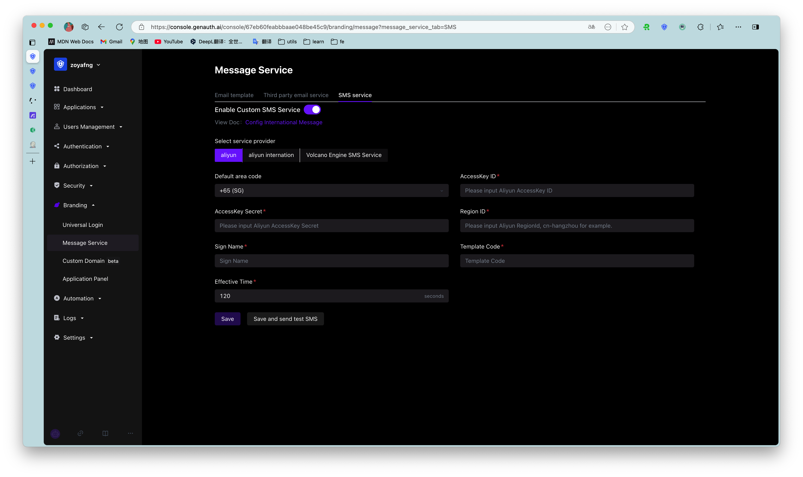

You can configure [Alibaba Cloud SMS Service](https://dysms.console.aliyun.com/) in **Settings**-**Message Service** of the console:

> For the official documentation of Alibaba Cloud SMS Service, please see: [Alibaba Cloud-International SMS: API Reference](https://help.aliyun.com/document_detail/101300.html)

- AccessKey ID, AccessKey Secret: This is the key for you to access the Alibaba Cloud API. You need to create an AccessKey in **RAM Access Control** and ensure that it has the permission to use the Alibaba Cloud SMS Service API;
- Region ID: RegionID of the SMS API, fill in `cn-hangzhou`;
- SMS Signature Name: SMS signature name. Please check it in the Signature Name column under the Signature Management tab on the International/Hong Kong, Macau and Taiwan Messages page of the console;
- Template Code: SMS template ID. Please check it in the Template CODE column under the Template Management tab on the International/Hong Kong, Macau and Taiwan Messages page of the console;
- Validity Time: The validity period of the SMS verification code.

After configuration, you can click **Save and send test SMS** in the upper left corner to test.
