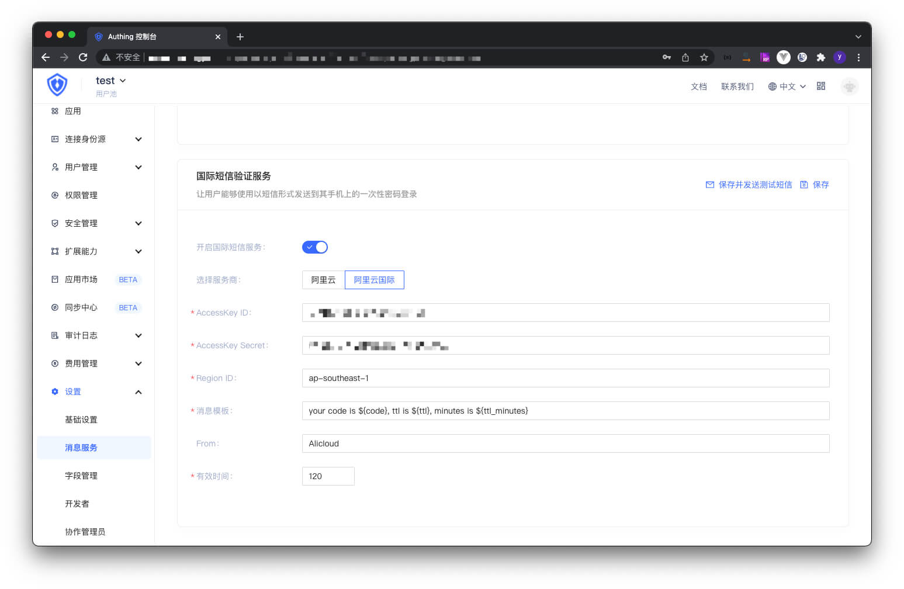

You can configure [Alibaba Cloud International SMS Service](https://sms-intl.console.aliyun.com/) in **Settings**-**Message Service** of the console:

> For the official documentation of Alibaba Cloud International SMS Service, please see: [Alibaba Cloud International-International SMS: API Reference](https://www.alibabacloud.com/help/zh/doc-detail/162279.htm)

- AccessKey ID, AccessKey Secret: This is the key for you to access the Alibaba Cloud API. You need to create an AccessKey in **RAM Access Control** and ensure that it has the permission to use the Alibaba Cloud SMS Service API;
- Region ID: RegionID of the SMS API, fill in `ap-southeast-1`;
- Message Template: SMS template. Customize the template for sending SMS. Currently supported variables are Verification Code: ${code}, Validity Time (Seconds): ${ttl}, Validity Time (Minutes): ${ttl_minutes};
- Validity Time: The validity time of the SMS verification code. Example: your code: ${code}. Valid for ${ttl_minutes} minutes.

After configuration, you can click **Save and send test SMS** in the upper left corner to test.
