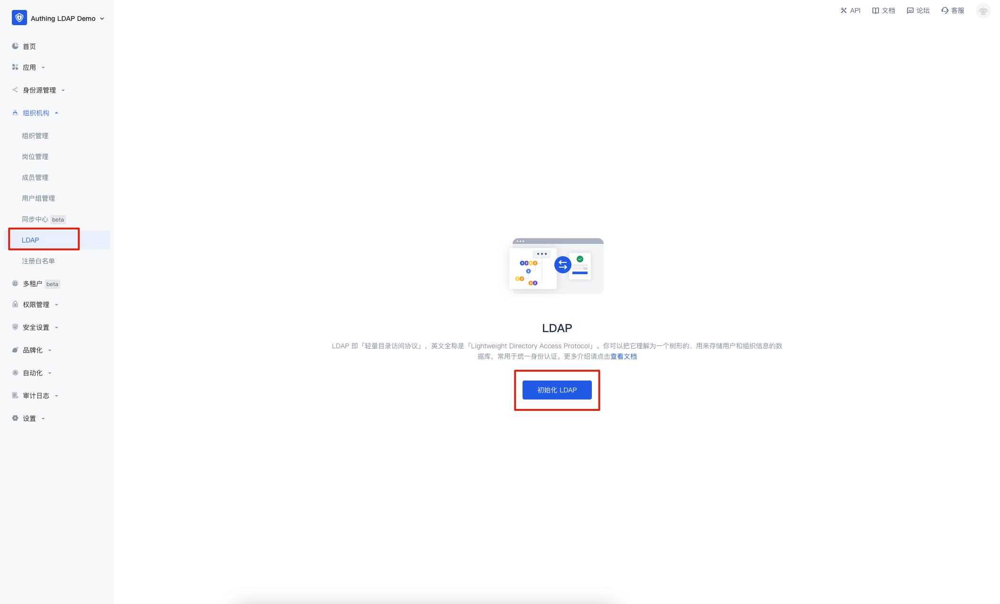
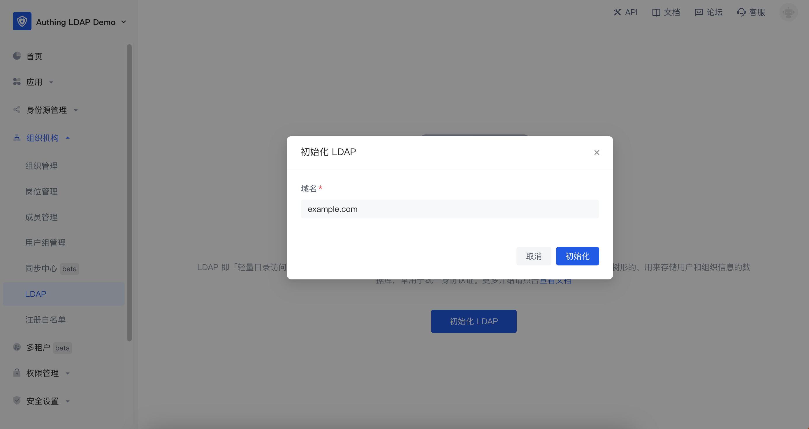
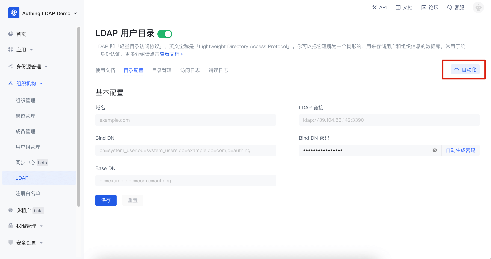
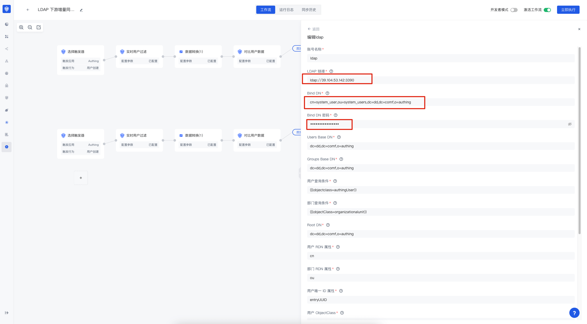
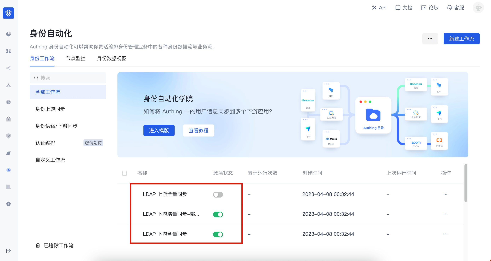
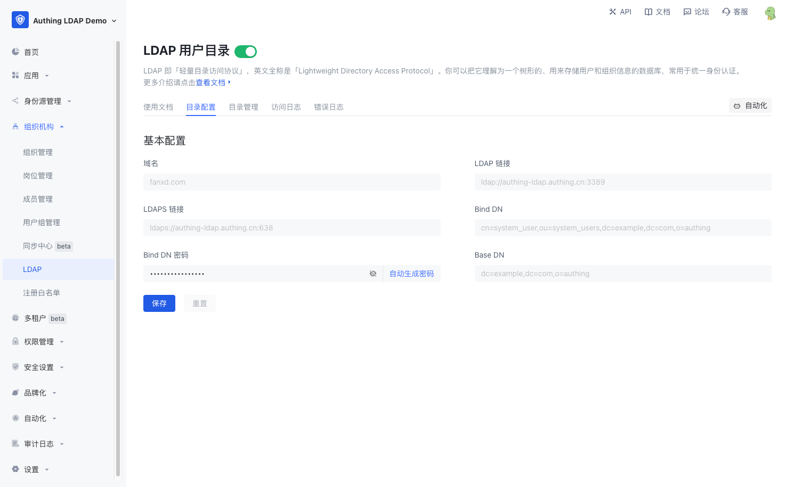
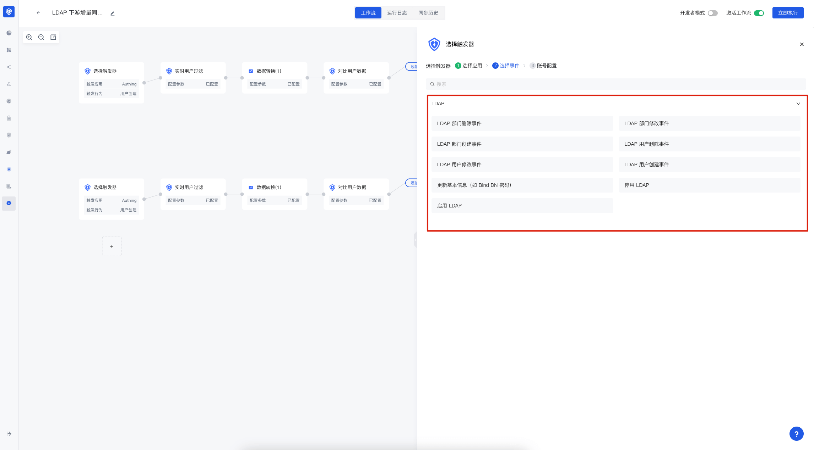

---
meta:
  - name: description
    content: LDAP User Directory
---

# Cloud LDAP User Directory using {{$localeConfig.brandName}}

<LastUpdated/>

{{$localeConfig.brandName}} supports viewing, modifying, adding, and deleting user information using the LDAP protocol. This page contains some basic information and usage tutorials. If you don't know what the LDAP protocol is, you can read the concepts - [What is LDAP](/concepts/ldap.md) first. {{$localeConfig.brandName}} LDAP 2.0 requires the use of identity automation related capabilities. If you don't know, you can read the [Identity Automation](/workflow/overview/) related concepts first.

## Version Notes

The {{$localeConfig.brandName}} LDAP 2.0 based on [OpenLDAP](https://www.openldap.org/) was released on April 12, 2023. It is recommended to use the {{$localeConfig.brandName}} LDAP 2.0 version; to use LDAP 2.0, you need to enable [Identity Automation](/workflow/overview/) first; if you still need to use the old version of LDAP, you can still refer to [LDAP 1.0](/guides/users/ldap-user-directory-v1). To understand the differences between LDAP 1.0 and 2.0, you can view (Differences between LDAP 1.0 and LDAP 2.0) [#Differences between ldap-1-0- and -ldap-2-0-]

## Migrate to LDAP 2.0

### Differences between LDAP 1.0 and LDAP 2.0

#### Differences in DN

{{$localeConfig.brandName}} LDAP 1.0 has some differences in directory structure from LDAP 2.0. The following is the basic structure of DN for LDAP 1.0:

```txt
# User DN
uid=USER_ID,ou=DEPARTMENT_NAME,o=ORG_NAME,ou=users,o=USER_POOL_ID,dc=authing,dc=cn

# Department DN
ou=DEPARTMENT_NAME,o=ORG_NAME,ou=users,o=USER_POOL_ID,dc=authing,dc=cn
```

The basic structure of DN in LDAP 2.0 is as follows:

```txt
# User DN
cn=xxx,ou=DEPARTMENT_NAME,ou=DEPARTMENT_NAME,dc=DOMAIN1,dc=DOMAIN2,o=authing

# Department DN
ou=DEPARTMENT_NAME,ou=DEPARTMENT_NAME,dc=DOMAIN1,dc=DOMAIN2,o=authing
```

From the above two DNs, we can see the following differences:

- Base DN will be different. The Base DN of LDAP 1.0 is composed of `ou=users,o=USER_POOL_ID,dc=authing,dc=cn`, and the Base DN of LDAP 2.0 is composed of `dc=DOMAIN1,dc=DOMAIN2,o=authing`, `DOMAIN1` and `DOMAIN2` are decomposed from the domain name you entered when initializing LDAP.

- The RDN of the user DN in LDAP 1.0 is `uid=USER_ID`, and the RDN of the user DN in LDAP 2.0 is `cn=xxx`, and the value of `xxx` is determined by the field mapping in Identity Automation.

#### Differences in user attributes

Searching for users in LDAP 1.0 will return all basic attributes and extended fields of the user {{$localeConfig.brandName}}, while the user attributes returned in LDAP 2.0 are completely determined by your configuration in the **data conversion node** of Identity Automation.

### Potential risks

- Due to inconsistent directory structures, the organizational information and other information in the LDAP downstream applications you previously connected to will also change after connecting to LDAP2.0.
- The login fields may change. For example, if you previously used the `email` field for LDAP login, but if you did not map the user mailbox of {{$localeConfig.brandName}} to the `email` field in the LDAP service in LDAP 2.0, LDAP authentication using the `email` field will fail.

### Solution

If migration is required, you need to map all user basic attributes to LDAP first. If you used extended fields before, you also need to map them to the `AuthingExtendedAttr1~AuthingExtendedAttr20` fields. After the downstream synchronization workflow is executed, you need to modify the `Base DN`, `Bind DN`, and `Bind DN Password` in the previously connected application, and test whether it can be used normally.

## Configure LDAP

Go to **Organization** -> **LDAP** menu and click "Initialize LDAP".


In the pop-up window, enter the LDAP domain name you want to set and click "Initialize". This domain name will eventually be used to generate your [LDAP Base DN](https://ldap.com/basic-ldap-concepts/). If you enter `example.com`, the final generated is `dc=example,dc=com,o=authing`.


After initialization, there is no user data in the LDAP service. {{$localeConfig.brandName}} will automatically create a workflow for your LDAP service to synchronize the user data of {{$localeConfig.brandName}} to the LDAP service. You need to click the "Automation" button in the upper right corner to enter the identity automation interface for configuration.


Currently, {{$localeConfig.brandName}} automatically creates three workflows for you:

- LDAP upstream full synchronization: used to synchronize all data in the LDAP service back to the {{$localeConfig.brandName}} organizational structure. If you do not need to modify user data through the LDAP protocol, it is recommended to turn it off.
- LDAP downstream full synchronization: used to synchronize all {{$localeConfig.brandName}} organizational structure data to the LDAP service. It is recommended to set its **trigger** to **scheduled task**. After initializing LDAP for the first time, you can manually execute this workflow once to synchronize users to the LDAP service.
- LDAP downstream incremental synchronization: used to incrementally synchronize {{$localeConfig.brandName}} organizational structure data to the LDAP service.
- If you want to use a third-party LDAP service, you can modify the **account connection** in the LDAP configuration node.
  
  How to select events

If you need to modify more configurations of the workflow, you can refer to [Identity Automation](/workflow/overview/).


## Using LDAP

The following will introduce the simple use of LDAP. All commands related to LDAP search are demonstrated using the `ldapsearch` tool.

### Basic information

#### Connection information

{{$localeConfig.brandName}} The basic connection information of LDAP can be obtained in the **Directory Configuration** interface of LDAP. The configuration information is as follows:

- Domain name: the LDAP domain name you entered
- LDAP link: the domain name, port and other information of the LDAP service
- LDAPS link: the domain name, port and other information of the service connected using LDAPS
- Bind DN: the account used to connect to the LDAP service
- Bind DN password: the password used to connect to the LDAP service. It cannot be modified manually. If you need to modify it, you can click "Auto-generate password" and save it
- Base DN: the base DN for searching LDAP



#### LDAP user attributes

{{$localeConfig.brandName}} The public cloud defines the `authingUser` objectClass in the LDAP service, which contains the following attributes:
| Attribute name | Remarks | Required or not|
|-------|-----|--------|
| id |User ID|Yes|
| cn |User name|Yes|
| externalId |External ID|No|
| email |Email|No|
| emailVerified |emailVerified|No|
| phone |Mobile number|No|
| phoneVerified |phoneVerified|No|
| username |User name|No|
| nickname |Nickname|No|
| company |Company|No|
| authingPhoto |Avatar url|No|
| name |Name|No|
| givenName |First name|No|
| familyName |Surname|No|
| middleName |middleName|No|
| preferredUsername |Preferred username|No|
| website |Personal website|No|
| gender |Gender|No|
| birthdate |Birthday|No|
| zoneinfo |Time zone|No|
| address |Address|No|
| formatted |formatted|No|
| authingStreetAddress |Street information|No|
| locality |Locality|No|
| region |Region|No|
| postalCode |Postal code|No|
| city |City|No|
| province |Province|No|
| country |Country|No|
| AuthingExtendedAttr1 |Extended field 1|No|
| AuthingExtendedAttr2 |Extended field 2|No|
| AuthingExtendedAttr3 |Extended field 3|No|
| ... |...|No|
| AuthingExtendedAttr20 |Extended field 20|No|

As described in the table above, the LDAP service contains almost all the basic fields of the user, as well as AuthingExtendedAttr1~AuthingExtendedAttr20 has 20 extended fields, which are used to map the user's extended fields to the LDAP service. You can perform specific field mapping in the **Data Conversion Node** of Identity Automation.

### Search

Based on the Base DN, the returned results include user data and organization data. -LLL means that information that does not match the filter condition is prohibited from being output. Without this option, you will get the number of entries in the obtained results and the requested partial information.

```bash
$ ldapsearch -H LDAP_SERVER_URL -x -D "LDAP_BASE_DN" -w "LDAP_BIND_DN_PASSWORD" -LLL -b "LDAP_BIND_DN"
```

#### Search Filter

Search and filter based on Base DN, and the returned results include user data and organization data.

> For all filtering functions, please refer to [RFC-2254](https://www.ietf.org/rfc/rfc2254.txt)

##### Equality

This search is based on cn, because organizations do not have this attribute, only users have this attribute, and the result will return the user information whose cn is `Xiaobai`.

```bash
$ ldapsearch -H LDAP_SERVER_URL -x -D "LDAP_BASE_DN" -w "LDAP_BIND_DN_PASSWORD" -LLL -b "LDAP_BIND_DN" -s sub '(cn=小白)'
```

##### 不等

Similar to 不等, this option searches for all information in LDAP that has the cn (user name) attribute and the attribute value is not U, because organizations do not have this attribute, only users have this attribute, and the result will return the entry information where the user name is not `hahhaha` (in fact, only users have the cn attribute, so the result is all user information).

```bash
$ ldapsearch -H LDAP_SERVER_URL -x -D "LDAP_BASE_DN" -w "BIND_DN_PASSWORD" -LLL -b "$LDAP_BIND_DN" -s sub '(!(cn=hahhaha))'
```

#### Search mode

##### base mode (only search for baseDN information)

base mode will only search and return BaseDN information

```
dn: LDAP_BASE_DN
...attribute related information...
```

```bash
$ ldapsearch -H LDAP_SERVER_URL -x -D "LDAP_BASE_DN" -w "LDAP_BIND_DN_PASSWORD" -b "LDAP_BIND_DN" -s base
```

##### one mode (only search for subnodes under baseDN information)

Taking the above figure as an example, one mode will search for `BaseDN` and `BaseDN child nodes` and returns relevant information.

```jsx
dn: LDAP_BASE_DN
...property related information...

dn: cn=xxx,LDAP_BASE_DN
...property related information...

dn: ou=xxx,LDAP_BASE_DN
...property related information...
```

```bash
$ ldapsearch -H LDAP_SERVER_URL -x -D "LDAP_BASE_DN" -w "LDAP_BIND_DN_PASSWORD" -b "LDAP_BIND_DN" -s one
```

##### sub mode (search for all nodes under baseDN information)

Taking the above figure as an example, the sub mode will search for `BaseDN` and `all nodes under BaseDN` and return relevant information.

```jsx
dn: LDAP_BASE_DN
...property related information...

dn: cn=xxx1,LDAP_BASE_DN
...property related information...

dn: ou=xxx,LDAP_BASE_DN
...property related information...

dn: cn=xxx2,o=develop,LDAP_BASE_DN
...property related information...
```

```bash
$ ldapsearch -H LDAP_SERVER_URL -x -D "LDAP_BASE_DN" -w "LDAP_BIND_DN_PASSWORD" -b "LDAP_BIND_DN" -s sub
```

#### Filter the returned results (return only the specified attributes)

If you have used SQL, this function is similar to `select`. Without adding filters, the result may be as follows:

```js
dn: LDAP_BASE_DN
cn: testcn
sn: testsn
...other attributes...
```

Add relevant filter conditions as shown in the figure, and the result will be as follows

```js
dn: LDAP_BASE_DN;
cn: testcn;
```

```bash
$ ldapsearch -H LDAP_SERVER_URL -x -D "LDAP_BASE_DN" -w "BIND_DN_PASSWORD" -b "$LDAP_BIND_DN" -s sub dn cn
```

---

### Add

Create a file named user.ldif and copy the following content into it:

```js
dn: (cn = username), LDAP_BASE_DN;
objectClass: authingUser;
cn: username;
```

Then execute the following command:

This operation will add a new user in the `LDAP service` `user`

```bash
$ ldapadd -H LDAP_SERVER_URL -x -D "LDAP_BASE_DN" -w "BIND_DN_PASSWORD" -f ./user.ldif
```

If you have LDAP upstream synchronization enabled in your workflow, this data will be synchronized back to the {{$localeConfig.brandName}} user pool.

---

### Modify

Create a file named modify.ldif and copy the following content into it:

```js
dn: cn=username, ou=xxx, LDAP_BASE_DN
changetype: modify
replace: mail
mail: test@example.com
```

Then execute the following command:

This operation will search for relevant user information in `LDAP service` according to `DN` in modify. If the search is successful, the operation `user information` will be selected according to `changetype`. `information` comes from the information under `changetype`

```bash
$ ldapmodify -H LDAP_SERVER_URL -x -D "LDAP_BASE_DN" -w "BIND_DN_PASSWORD" -f ./modify.ldif
```

If you have enabled LDAP upstream synchronization in the workflow, this data will be synchronized back to the {{$localeConfig.brandName}} user pool.

---

### Delete

This operation will search for relevant user information based on `DN` in `LDAP service`. If the search is successful, it will be deleted. This is a sensitive operation.

```bash
$ ldapdelete -H LDAP_SERVER_URL -x -D "LDAP_BASE_DN" -w "BIND_DN_PASSWORD" "cn=username, ou=xxx, LDAP_BASE_DN"
```

If you have enabled LDAP upstream synchronization in the workflow, this data will also be deleted in the {{$localeConfig.brandName}} user pool.

---

### Other

#### compare

This operation is used to determine whether the `DN` value and the `specified entry value` in the `LDAP Server` directory tree belong to the same entry. If yes, it returns `true`, otherwise it returns `false`

```bash
$ ldapcompare -H LDAP_SERVER_URL -x -D "LDAP_BASE_DN" -w "BIND_DN_PASSWORD" "uid=uid,o=oid,LDAP_BASE_DN" "cn:xxx"
```

#### modifyDN

It is used to modify the `RDN` entry in the `LDAP Server`. It can be entered from the standard entry information. `RDN` refers to the first item of `DN`, such as `cn=oldUserName` in `"cn=oldUserName, o=Org_ID, LDAP_BASE_DN" "cn=newUserName"`. Since most of the information related to `user's DN` and `organizational structure's DN` are `id` related values, when you modify `cn=oldUserName` is actually `equivalent to` modifying the username

```bash
$ ldapmodrdn -H LDAP_SERVER_URL -x -D "LDAP_BASE_DN" -w "BIND_DN_PASSWORD" "cn=oldUserName,o=Org_ID,LDAP_BASE_DN" "cn=newUserName"
```

#### whoami

Used to verify the identity of the `LDAP server`. If you enter the correct bind DN and password, the specified information will be returned. Otherwise, the error `ldap_bind: invalid credentials(49)` will be prompted. This is generally caused by `wrong password`. Please check the `corresponding password` and `bind DN information`. Returns information `test@example.com`

```bash
$ ldapwhoami -H LDAP_SERVER_URL -x -D "LDAP_BASE_DN" -w "BIND_DN_PASSWORD"
```

## LDAP Events

If you want to use LDAP related events in identity automation, you can select LDAP application in **Triggers**, and then select events.

