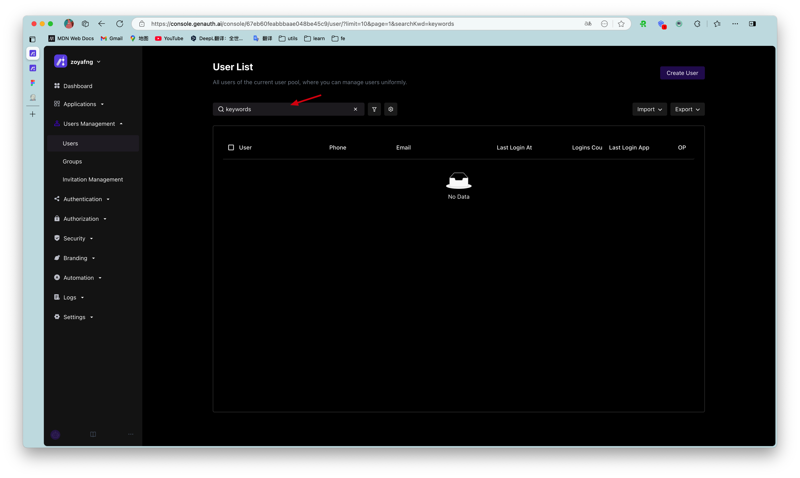

---
meta:
  - name: description
    content: Search user
---

# Search user

<LastUpdated/>

{{$localeConfig.brandName}} supports fuzzy search of users by email, username, phone number, nickname and other fields, and supports both [console](#use console search) and [SDK](#use-sdk-search) modes:

## Use console search

You can search users by keywords on the **User Management** - **User List** page:

Supported search fields include email, username, phone number, nickname, etc.

## Use SDK search

!!!include(common/sdk-list.md)!!!

You can use the **search user** method of the **User Management Module (UsersManagementClient)** in each language.