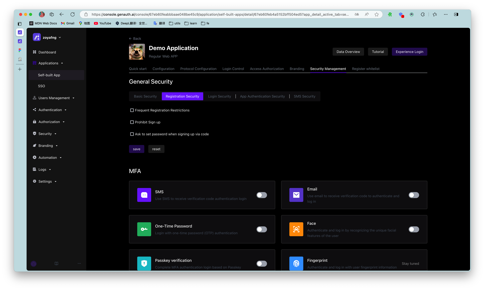
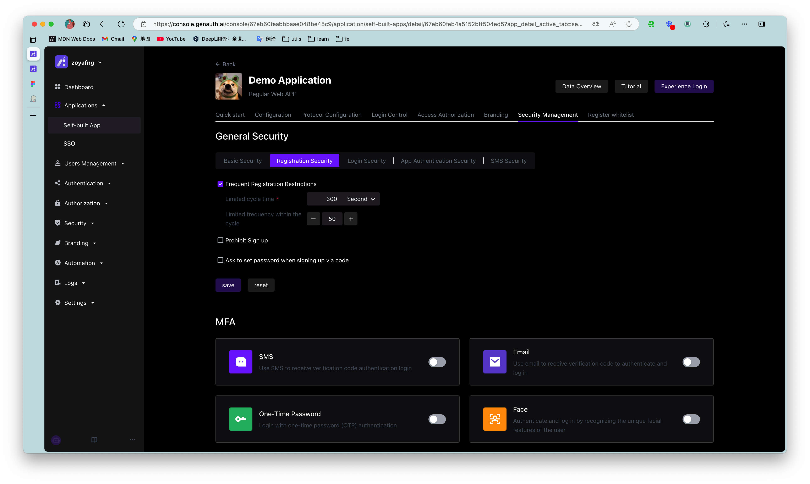
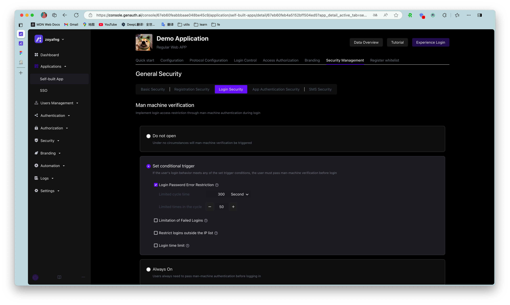
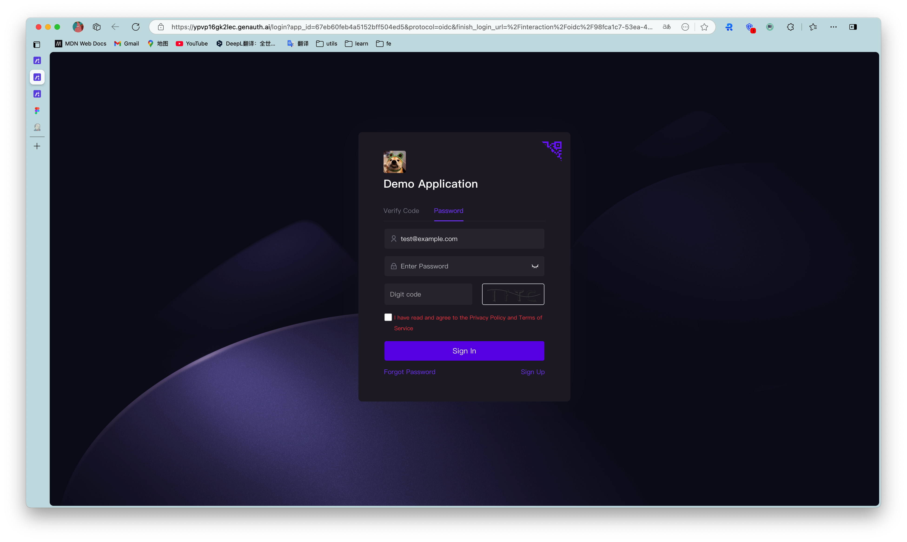
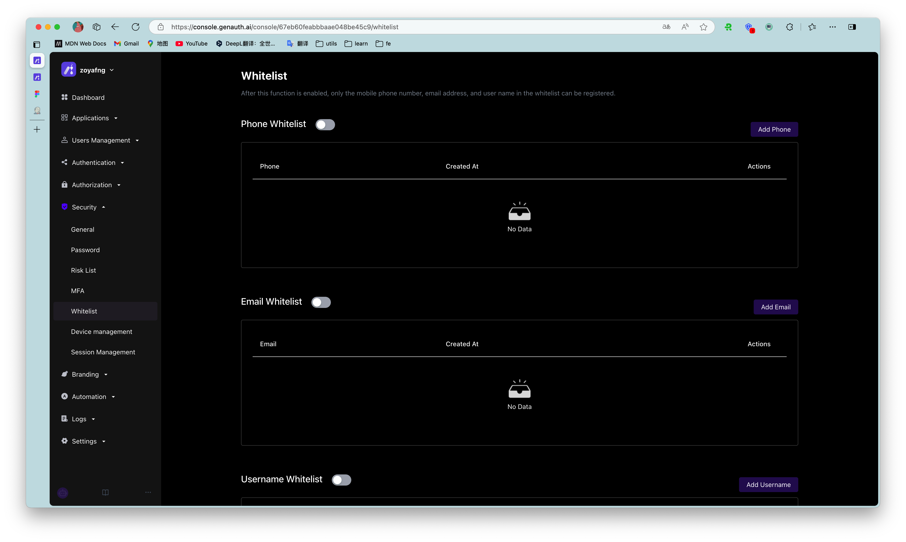
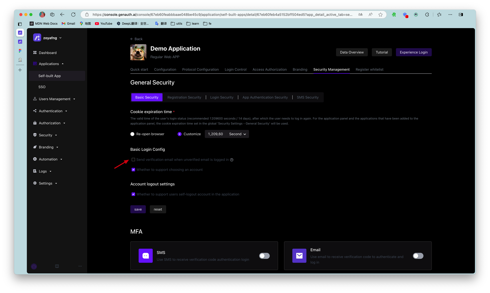
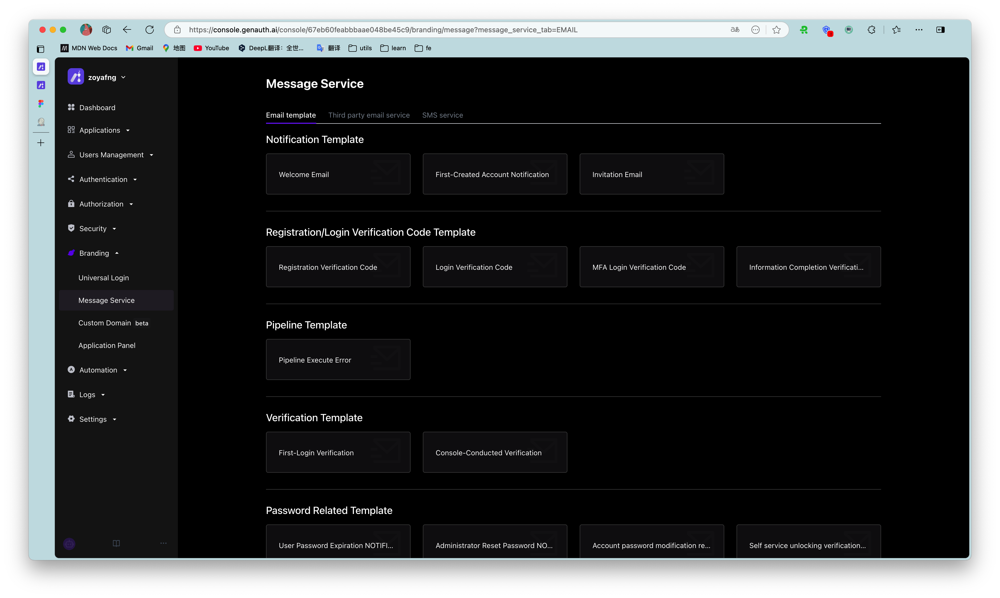

---
meta:
  - name: description
    content: User Directory Configuration Items
---

# User Directory Configuration Items

<LastUpdated/>

This article introduces some configuration items related to the user directory, such as registration prohibition, frequent registration restrictions, login failure limit, registration whitelist, etc.

## Registration prohibition

You can turn on the **registration prohibition** switch in **Security Settings->General Security->Registration Security** in the console:

After turning on "registration prohibition", ordinary users will not be able to register through the login form or API, and only administrators can manually create accounts.

## Frequent registration limit

You can turn on the **Frequent registration limit** switch in **Security Settings->General Security->Registration Security** of the console to limit the number of registrations within a certain number of seconds:

## Login failure limit

You can turn on the **Login failure limit** switch in **Settings** - **Security Information** of the console to limit the number of failed logins of **the same account** within a certain number of seconds:

If the number of logins exceeds the specified time, the user needs to enter a graphic verification code to log in again:

## Configure registration whitelist

You can turn on the email, mobile phone number, and user name whitelist in **Organization->Registration whitelist** of the console. After turning it on, only the mobile phone numbers, email addresses, and user names in the whitelist can be registered (administrators manually create accounts without restrictions).

## Disable login for users with unverified email addresses

By default, accounts with unverified email addresses can log in. You can also modify this configuration in **Security Settings->General Security->Login Security**:

## Send a welcome email when registering

No welcome email will be sent after turning it off.

> You can customize the welcome email template.

