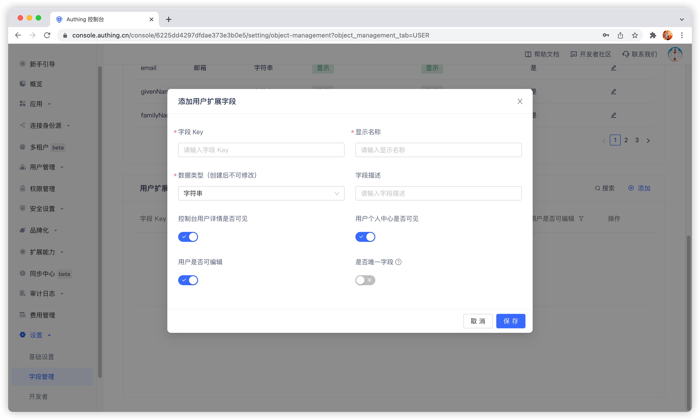
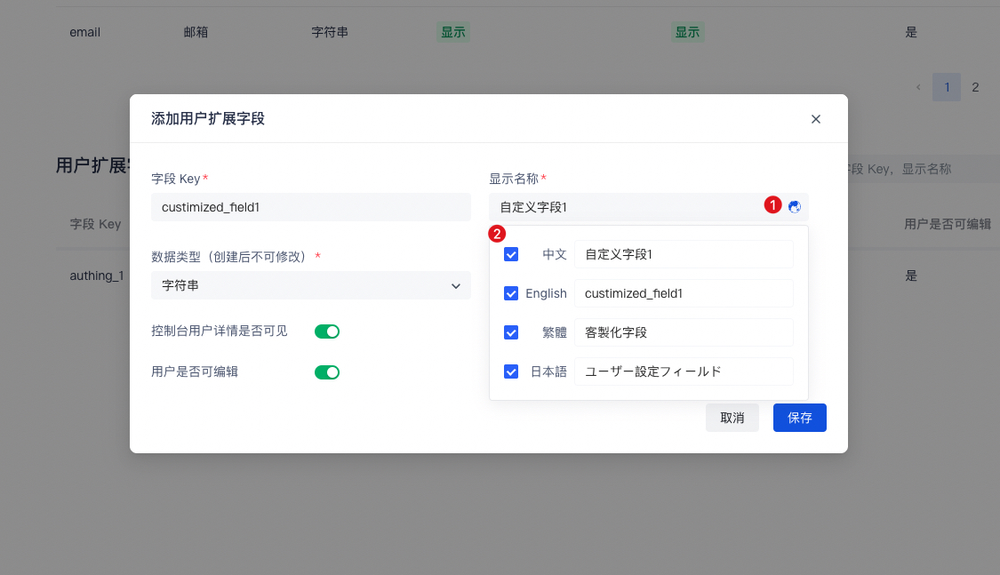
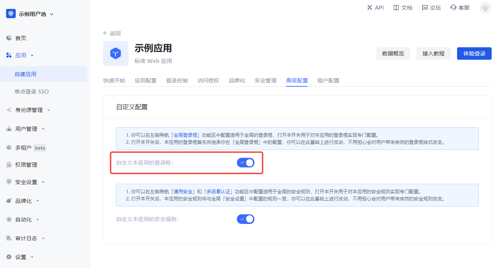
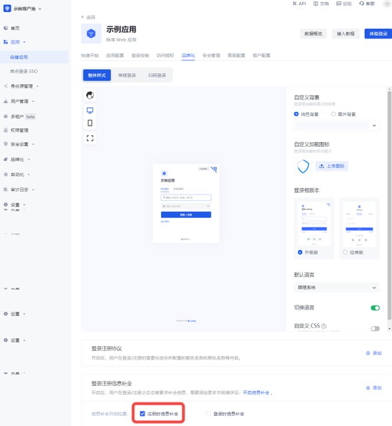
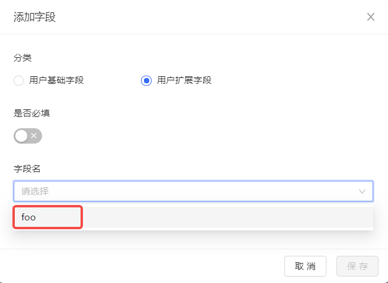
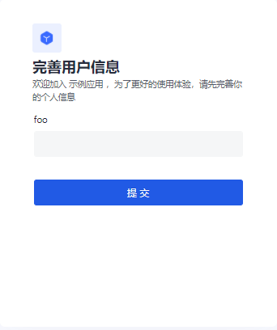
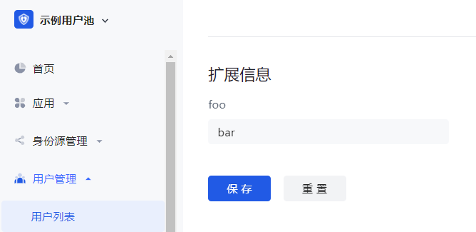

# Add custom user fields

<LastUpdated/>

User custom fields are additional fields that can be added to user objects in addition to [basic user fields](/guides/user/user-profile.md). Developers can store **a small amount** of business-related data by setting custom fields.

## Configure custom user fields

You can define the following types of custom fields:

- String;
- Numeric;
- Date;
- Boolean;
- Enumeration;

You can configure custom user fields on **Settings** - **Field Management** - **User Extended Field** page:

When naming a newly created custom field, you can edit the display name of the field in multiple language environments:

- Edit directly in the input box under "Display Name" to get the default displayed field name
- Check "Chinese" and edit the field display name in the Chinese environment
- Check "English" and edit the field display name in the English environment
- Check "Traditional" and edit the field display name in the Traditional Chinese environment
- Check "Japanese" and edit the field display name in the Japanese environment

In particular, if the display environment of the field is not included in the above four language environments, it will be displayed using the "default displayed field name" you configured.

After configuring custom fields, you can open the registration information completion page of the application and let users complete the information of these custom fields.

On the **App Details** - **Advanced Configuration** page, turn on **Customize the login box of this application**

Then switch to **Branding**, check the **Enable registration information completion** switch, and then select the custom field you just added:

**Data Type** You can choose string, number, Boolean value, enumeration value, date, which will determine the final display style of the page.

Click Save and then visit the login page of the application.

After the user clicks register, he will be redirected to the following registration information completion page:

After the user successfully registers, you can see the custom field value just entered by the user on the user details page:

## Use API & SDK to manage user custom data

!!!include(common/sdk-list.md)!!!

<StackSelector snippet="udf" selectLabel="Select language" :order="['java', 'javascript', 'python', 'csharp', 'swift']"/>