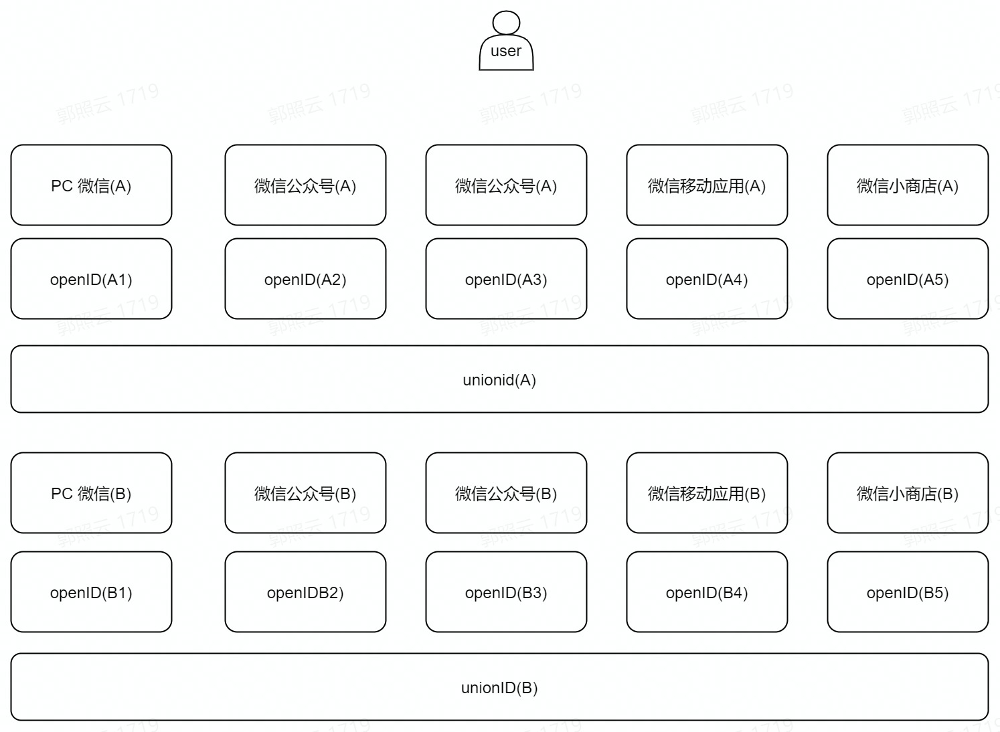
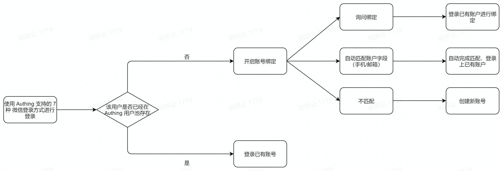
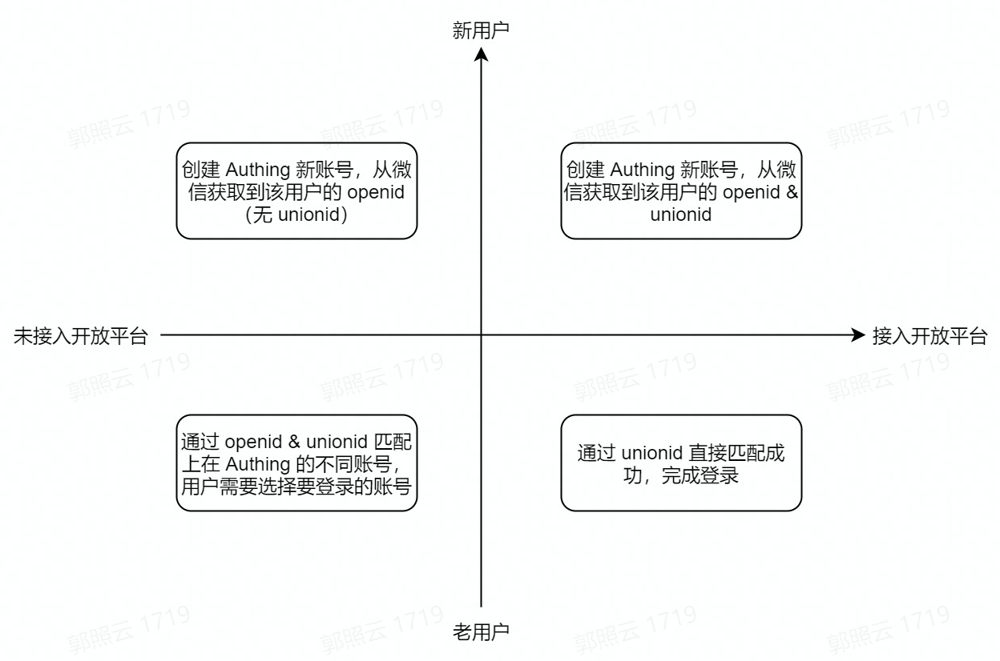

# WeChat Ecosystem Full Scenario Capabilities

<LastUpdated/>

> Enjoy WeChat Ecosystem Capabilities More Conveniently with {{$localeConfig.brandName}}!

As a WeChat Ecosystem developer, you may face many confusions when implementing WeChat login capabilities for your application:​

- What is the creation and configuration process of different types of applications in WeChat? ​

- As a developer of different types of applications, what options are available when implementing WeChat login capabilities? ​

- How to complete the configuration and login of various types of WeChat login methods? ​

- How do you manage the user identity in the WeChat ecosystem after WeChat users log in to your newly developed application?

## {{$localeConfig.brandName}} WeChat Ecosystem Function Panorama

If you have the above confusion and don't know how to start, {{$localeConfig.brandName}} WeChat Ecosystem Full Scenario Capabilities can help you implement WeChat login processes in various scenarios. The following table shows the full-scenario WeChat ecosystem operation process supported by {{$localeConfig.brandName}} and the WeChat login capability types available in the corresponding scenarios. You can click directly to learn the required functions:

<table>
  <thead>
    <tr>
      <th style="text-align:left">Scenario</th>
      <th style="text-align:left">WeChat Ecosystem Operation Process</th>
       <th style="text-align:left">WeChat Login Capability Type</th>
    </tr>
  </thead>
  <tbody>
    <tr>
      <td style="text-align:left"><a href="https://open.weixin.qq.com/cgi-bin/frame?t=home/app_tmpl&lang=zh_CN">Mobile Application Development</a></td>
      <td style="text-align:left"><ul>
          <li>Create an application. </li>
          <li>Submit for review. </li>
          <li>Go online after passing the review. </li>
        </ul></td>
      <td style="text-align:left"><ul>
          <li><a href="https://docs.genauth.ai/guides/connections/social/wechat-mobile/">Mobile APP pulls up WeChat APP</a></li>
          <li><a href="https://docs.genauth.ai/guides/connections/social/wechat-miniprogram-applaunch/">APP pulls up mini program login</a></li>
        </ul></td>
    </tr>
        <tr>
      <td style="text-align:left"><a href="https://open.weixin.qq.com/cgi-bin/frame?t=home/web_tmpl&lang=zh_CN">Website application development</a></td>
      <td style="text-align:left"><ul>
          <li>Common applications. </li>
          <li>Submit for review. </li>
          <li>Approved and launched. </li>
        </ul></td>
      <td style="text-align:left"><ul>
          <li><a href="https://docs.genauth.ai/guides/connections/social/wechat-pc/">PC WeChat code scanning</a></li>
          <li><a href="https://docs.genauth.ai/guides/connections/social/wechat-miniprogram-qrconnect/">PC mini program code scanning</a></li>
        </ul></td>
    </tr>
    <tr>
      <td style="text-align:left">WeChat public account development</td>
      <td style="text-align:left"><ol>
          <li><a href="https://mp.weixin.qq.com/">Complete registration and authentication on the WeChat public platform. </a>
          <ul>
          <li>Register a public account. </li>
          <li>Become a developer. </li>
          <li>Apply for WeChat authentication. </li>
        </ul></li>
          <li><a href="https://open.weixin.qq.com/">Bind WeChat public account on WeChat Open Platform. </a><ul>
          <li>Enter basic information. </li>
          <li>Security verification. </li>
          <li>Bind successfully. </li>
        </ul></li>
        </ol></td>
      <td style="text-align:left"><ul>
          <li><a href="https://docs.genauth.ai/guides/connections/social/wechatmp-qrcode/">Login by scanning the WeChat public account</a></li>
          <li><a href="https://docs.genauth.ai/reference/sdk-for-weixin-official-account.html">Login by launching the WeChat APP in the WeChat browser</a></li>
        </ul></td>
    </tr>
        <tr>
      <td style="text-align:left">Mini program development</td>
      <td style="text-align:left"><ol>
          <li><a href="https://mp.weixin.qq.com/cgi-bin/wx?token=&lang=zh_CN">Register the WeChat mini program and complete the development. </a>
          <ul>
          <li>Register the mini program. </li>
          <li>Start development. </li>
          <li>Code implementation. </li>
          <li>Submit for review and release. </li>
        </ul></li>
          <li>Bind the WeChat mini program on the WeChat Open Platform. <ul>
          <li>Enter basic information. </li>
          <li>Security verification. </li>
          <li>Bind successfully. </li>
        </ul></li>
        </ol></td>
      <td style="text-align:left"><a href="https://docs.genauth.ai/reference/sdk-for-weixin-miniapp.html">Mini app one-click login</a></td>
    </tr>
  </tbody>
</table>

## {{$localeConfig.brandName}} WeChat ecological account system

### Basic concepts of WeChat user account system

WeChat provides `OpenID` and `UnionID` as user identification. The difference between the two is as follows:

<table>
  <thead>
    <tr>
      <th style="text-align:left">ID Name</th>
      <th style="text-align:left">Description</th>
    </tr>
  </thead>
  <tbody>
    <tr>
      <td style="text-align:left">OpenID</td>
      <td style="text-align:left"><ul>
          <li>OpenID is the identity ID of WeChat users in different types of products. ​</li>
          <li>WeChat users will have unique OpenIDs when accessing public accounts, mini programs, mobile applications, website applications, small stores, etc. ​</li>
          <li>The OpenIDs generated by the same WeChat user when accessing different products are also different. For example, the OpenIDs of the same user are different for different public accounts; similarly, the OpenIDs of the same user are different for different mini programs. </li>
        </ul></td>
    </tr>
      <tr>
      <td style="text-align:left">UnionID</td>
      <td style="text-align:left"><ul>
          <li>UnionID is the identity ID of WeChat users in the same open platform. ​​</li>
          <li>If a developer has multiple mobile applications, website applications and public accounts (i.e. public accounts and mini-programs), UnionID can be used to distinguish the uniqueness of users. Because as long as they are mobile applications, website applications and public accounts under the same WeChat open platform account, the user's UnionID is unique, that is, the same user has the same UnionID for different applications under the same WeChat open platform. ​</li>
        </ul></td>
    </tr>  
  </tbody>
</table>

To put it in a figurative way, the unique identification of an independent WeChat user in different login scenarios of WeChat can be shown in the following figure:

### WeChat user login process in {{$localeConfig.brandName}}

After understanding the WeChat user account system, it will be easier for you to understand a WeChat user's login journey in {{$localeConfig.brandName}}:

- First, your user logs in using one of the seven login methods supported by {{$localeConfig.brandName}}. During login, {{$localeConfig.brandName}} will determine whether the user already exists in your user pool. If so, your user will directly log in to the existing account through this identity source. ​

- If it does not exist, and your {{$localeConfig.brandName}} console has enabled "account binding" for this identity source, it will be judged according to the specific functional logic that takes effect:​

  - The user successfully binds to the existing account and logs in successfully​.

  - Automatically match existing accounts (mobile phone/email) and complete login.

  - If the match is not successful/binding is unsuccessful, the user cannot log in.

### {{$localeConfig.brandName}} Account Solution Based on WeChat Ecosystem

Based on "whether the user exists in the {{$localeConfig.brandName}} user pool" and "whether your WeChat application has been connected to the WeChat Open Platform", there are four scenarios for your account processing:

When a user of the WeChat ecosystem enters the {{$localeConfig.brandName}} user pool through WeChat login, there are four possible scenarios, which are considered from two dimensions:

- Does the user have `UnionID` in the WeChat Open Platform?

- Is the user a new user in the {{$localeConfig.brandName}} user pool?

This is divided into four scenarios:

- The user has `UnionID` in WeChat Open Platform and is a new user in the {{$localeConfig.brandName}} user pool (first quadrant). In this case, when the user logs in to the application that has been integrated in {{$localeConfig.brandName}} through WeChat for the first time, a new account will be created in your {{$localeConfig.brandName}} user pool, and the user account information will include the user's `OpneID` and `UnionID` obtained from WeChat Open Platform.

- The user does not have `UnionID` in WeChat Open Platform and is a new user in the {{$localeConfig.brandName}} user pool (second quadrant).  In this case, when a user logs in to an application that has been integrated in {{$localeConfig.brandName}} for the first time through WeChat, a new account will be created in your {{$localeConfig.brandName}} user pool. The user account information will also include the `OpneID` obtained from the WeChat interface, but because the WeChat application has not joined the WeChat Open Platform, this account information does not include the `UnionID`.

- The user does not have a `UnionID` in the WeChat Open Platform and is an old user in the {{$localeConfig.brandName}} user pool (third quadrant).  In this case, when a user logs in to an application that has been integrated in {{$localeConfig.brandName}} through WeChat, because the account already exists, it will be matched through `OpneID` and `UnionID` during login. When the same WeChat account can correspond to multiple accounts in your user pool due to different `OpneID` and `UnionID`, account selection will be supported, and login will be completed after selection.

- The user has `UnionID` in WeChat Open Platform and is an old user in the {{$localeConfig.brandName}} user pool (quadrant 4).   In this case, when the user logs in to the application integrated in {{$localeConfig.brandName}} through WeChat, since the account already exists and there is no situation where `UnionID` does not exist, it will be directly matched successfully through `UnionID` and complete the login.

## In what scenarios can the {{$localeConfig.brandName}} WeChat ecosystem help you?

### More convenient use of WeChat full-scenario login capabilities

- [When you use the mobile WeChat app for development](/guides/wechat-ecosystem/wechat-mobile-app.md)

- [When you use the web WeChat app for development](/guides/wechat-ecosystem/wechat-web-app.md)

- [When you use WeChat public accounts for development](/guides/wechat-ecosystem/wechat-public-account-app.md)

- [When you use WeChat mini-programs for development](/guides/wechat-ecosystem/wechat-miniprogram-app.md)

### More flexible management of user accounts from WeChat

For security and user convenience, you may not want your users to re-create an account every time they log in to {{$localeConfig.brandName}} using their WeChat accounts. {{$localeConfig.brandName}} supports "field matching" and "query binding" to ensure your users' unique identity in {{$localeConfig.brandName}} and ensure that user account information is unified.

For details on the "account binding" function and usage, please refer to [account binding](/guides/connections/account-binding.md).
