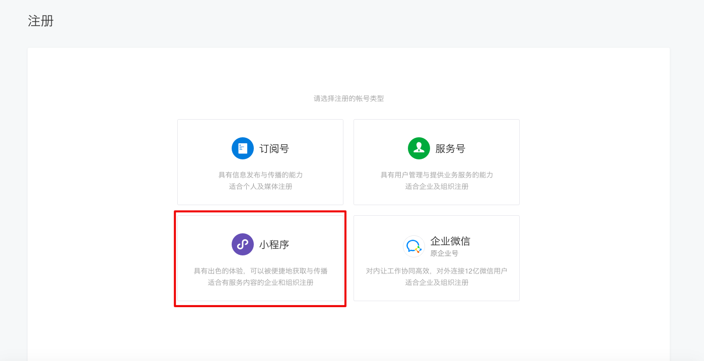
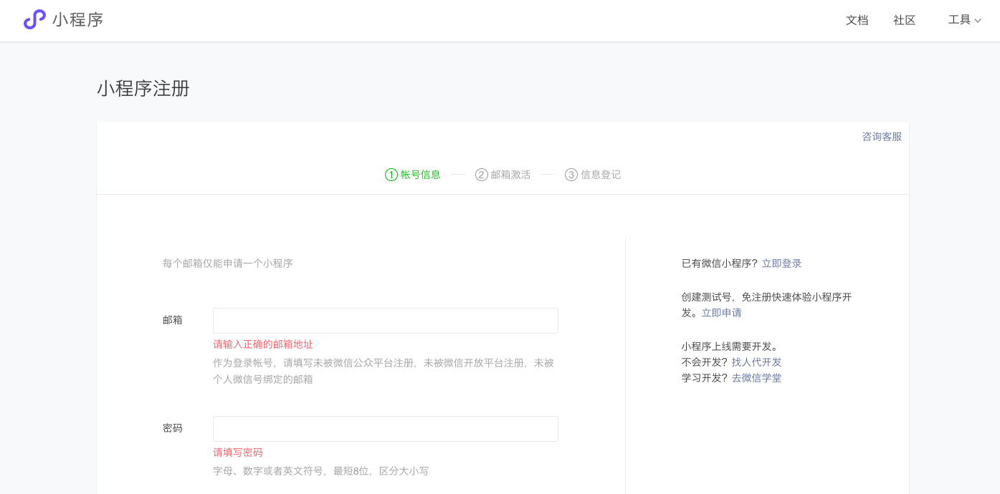
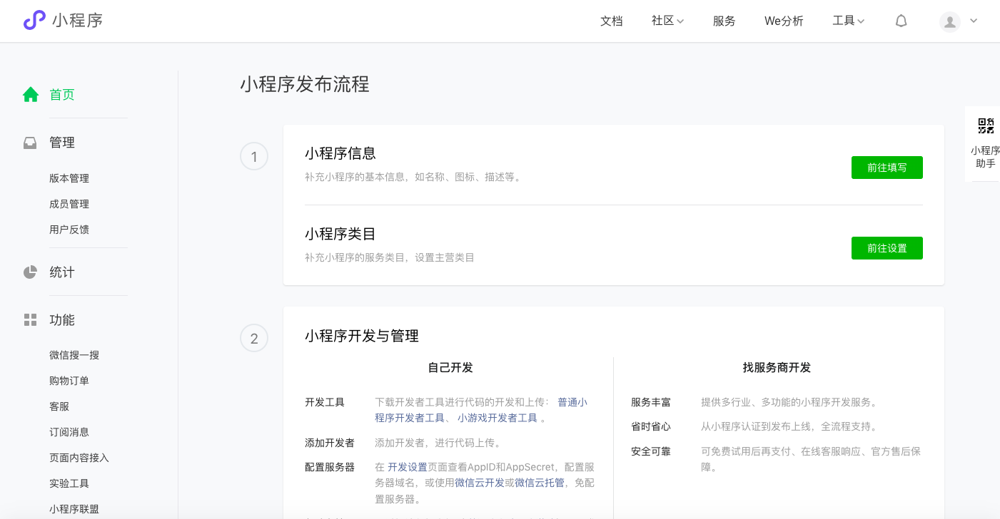
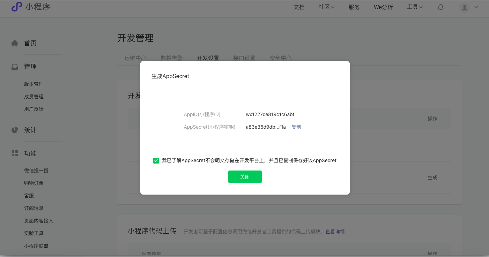
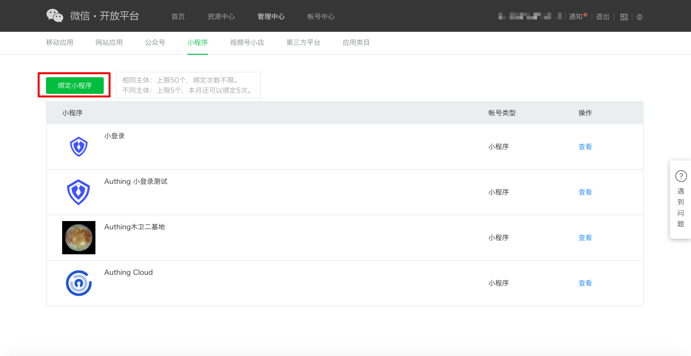
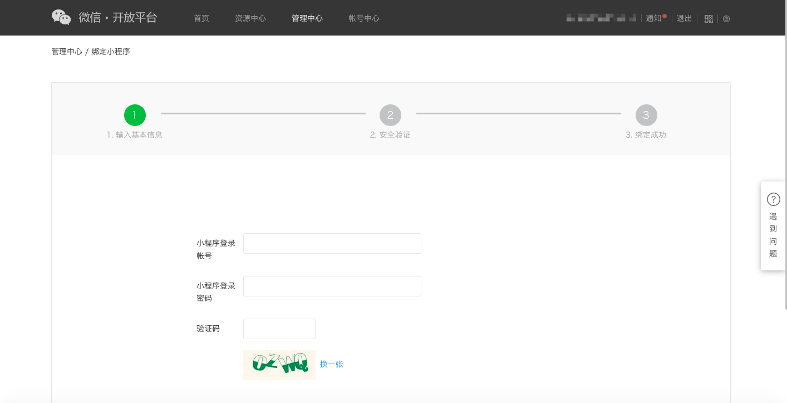
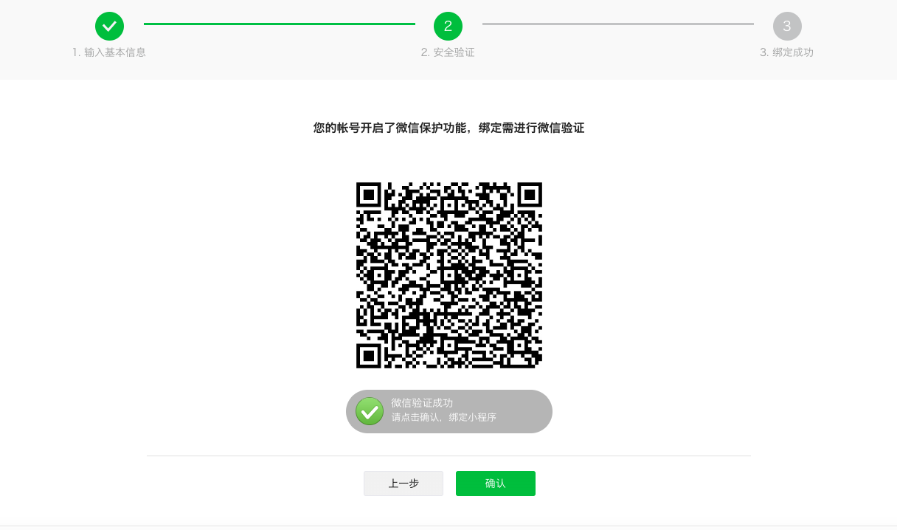
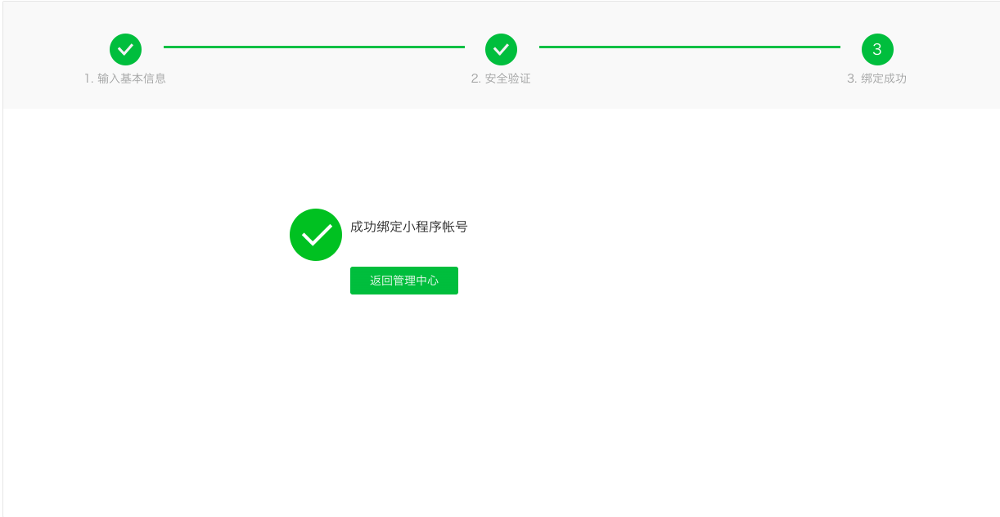
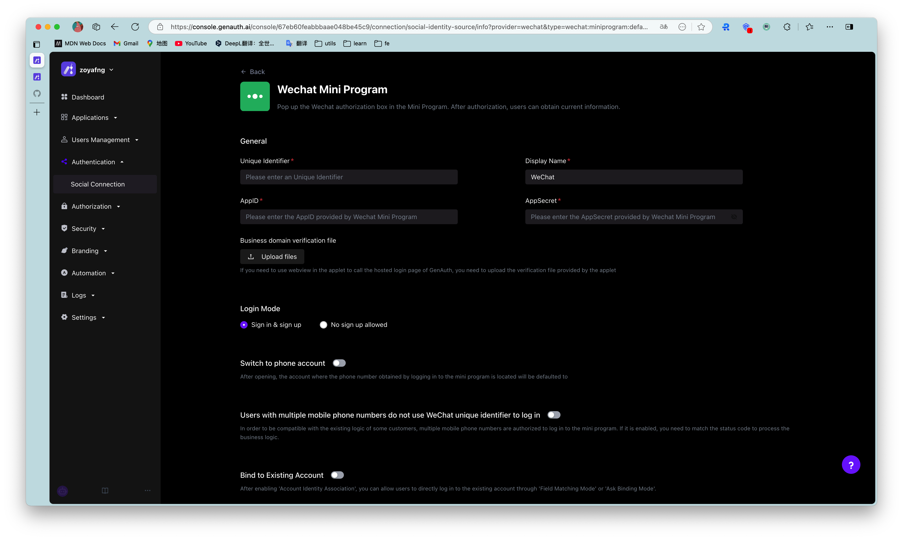
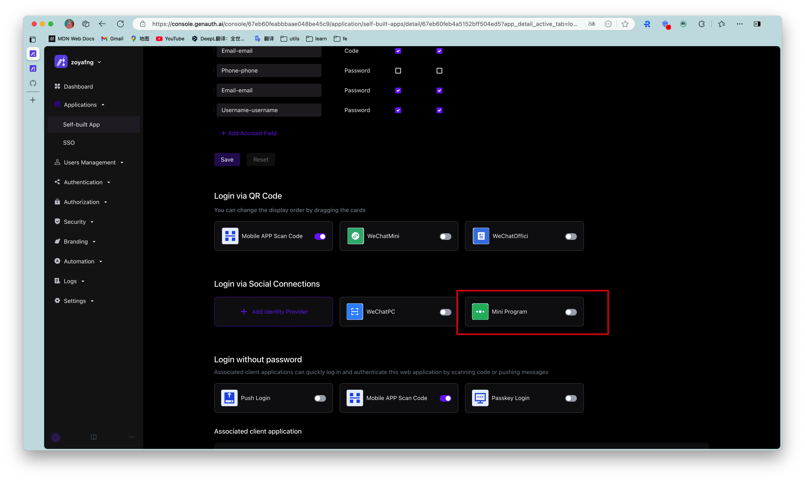

# When you use WeChat Mini Programs for development

<LastUpdated/>

## WeChat Open Platform preparation

### Register a WeChat Open Platform account

Before developing WeChat ecosystem applications, you must first register as a developer of the WeChat Open Platform. If you do not have a WeChat Open Platform account, please [go to register](https://open.weixin.qq.com/wxaopen/regist/index).

### Apply for developer qualification certification

After completing the WeChat Open Platform account registration, you need to fill out the developer qualification certification application in the **Account Center** and wait for the certification to pass.

### Launch your mini program

#### Step 1: Create a mini program

1. Before creating a mini program, you need to [register an account on the WeChat public platform](https://mp.weixin.qq.com/cgi-bin/registermidpage?action=index&lang=zh_CN&token=) and select the type as **Mini Program**.

2. Fill in "Account Information", "Email Activation" and "Information Registration" in turn to complete the registration.

3. After successful registration, the mini program account is created successfully. You can configure the mini program information on the WeChat public platform to complete the release.

::: hint-info
You can see **AppID** and **AppSecret** on the **Development Management->Development Settings** page, which will be used to configure the mini program identity source in {{$localeConfig.brandName}} later.​
:::

#### Step 2: Bind Mini Program

After creating a mini program, you need to bind the mini program in WeChat Open Platform to ensure that different applications logged in under the same WeChat Open Platform account have a unique `UnionID`.

1. After logging in to your [WeChat Open Platform](https://open.weixin.qq.com/), click **Bind Mini Program** under **Admin Center->Mini Program**.

2. Complete "Enter basic information", "Security verification", and "Bind successfully" in sequence.

::: hint-info
During "security verification", it is necessary to ensure that the mini program account:

- Passed WeChat qualification certification.
- Is not currently bound.
- The mini program corresponding to the account has set administrator information.

Verification can only be successful if the above conditions are met.
:::

::: img-description
Mini program verification is successful
:::

::: img-description
Mini program binding is successful
:::

## Implement WeChat login capability in {{$localeConfig.brandName}}

### Developer scenario using WeChat login

You want to implement the WeChat login capability on the web by creating a WeChat application. According to the above steps, you have completed the creation of the WeChat application. Next, you don’t have to read the massive and complicated WeChat documents anymore, but can directly implement WeChat login for your application through {{$localeConfig.brandName}} "zero code" method.

### Choose the right WeChat login method

In the "Mini Program" development scenario, {{$localeConfig.brandName}} supports [WeChat Mini Program](/reference/sdk-for-weixin-miniapp.md) login capabilities.

### Configuration process

To configure the WeChat Mini Program login method, follow the following process:

#### Step 1: Integrate the mini program that needs to be configured with WeChat login in {{$localeConfig.brandName}}

Currently, {{$localeConfig.brandName}} does not support the creation of mini program type applications. It is currently not possible to integrate WeChat mini program applications in {{$localeConfig.brandName}}. Please stay tuned.

#### Step 2: Create WeChat login method in your {{$localeConfig.brandName}} user pool

{{$localeConfig.brandName}} supports 20+ third-party account login methods. You can view all the identity sources supported by {{$localeConfig.brandName}} in [Connecting to an External Identity Provider](/guides/connections/README.md).

Configure Mini Program Login:

Mini Program Login allows your users to log in to Mini Programs securely using their WeChat identities. After enabling Mini Program Login in {{$localeConfig.brandName}}, users can use the Mini Program login in WeChat to call up the authorization pop-up window to obtain WeChat user information. For more information about the configuration process, see [WeChat Mini Program SDK](/reference/sdk-for-weixin-miniapp.md).

#### Step 3: Enable the WeChat login method you configured for the integrated {{$localeConfig.brandName}} application

After completing the third-party login configuration, enable the corresponding login method in the application you have integrated (**self-built application-> application details page-> login control-> social login method**).

::: hint-info
**Note**: The social login method of mini-program applications only displays the identity source of the mini-program class. This page can also be configured only after supporting mini-program applications. ​
:::

The following is a schematic diagram:

Congratulations! You have completed the WeChat login configuration. Now you can experience the WeChat login you implemented in the "Experience Login" of the application!

## Daily account management of WeChat applications

User accounts on the WeChat platform use `OpenID` and `UnionID` as unique identifiers. Since WeChat did not require all applications to join the WeChat Open Platform in the early years, some accounts did not have `Unionid`. Later WeChat regulations required that all applications must rely on the WeChat Open Platform. Users who log in to these applications created by the WeChat Open Platform have both `OpenID` and `UnionID` as unique identifiers. For the difference between the two, please refer to [Introduction to WeChat Ecosystem Account System](/guides/wechat-ecosystem/#localeconfig-brandname-微信生态账号系统).

Based on the WeChat account system, there are two scenarios when your users log in through WeChat:

* New users log in through WeChat

* Old users log in through WeChat

For different scenarios of new and old users logging in, {{$localeConfig.brandName}} supports the "account binding" function to ensure the uniqueness of your users' accounts in {{$localeConfig.brandName}}.

For an introduction to the "Account Binding" function and usage details, please refer to [Account Binding](/guides/connections/account-binding.md).

## Other Notes

When your application on WeChat Open Platform has been offline or disabled, the application you integrated in {{$localeConfig.brandName}} will no longer be able to log in using WeChat.