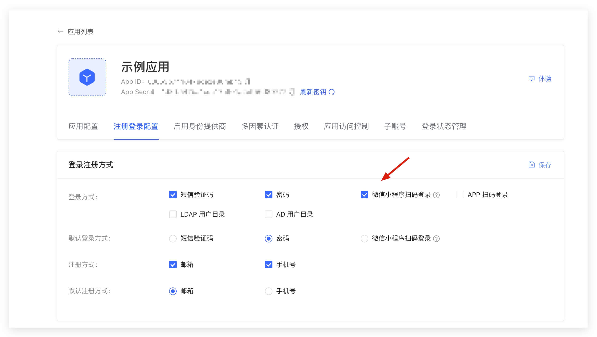
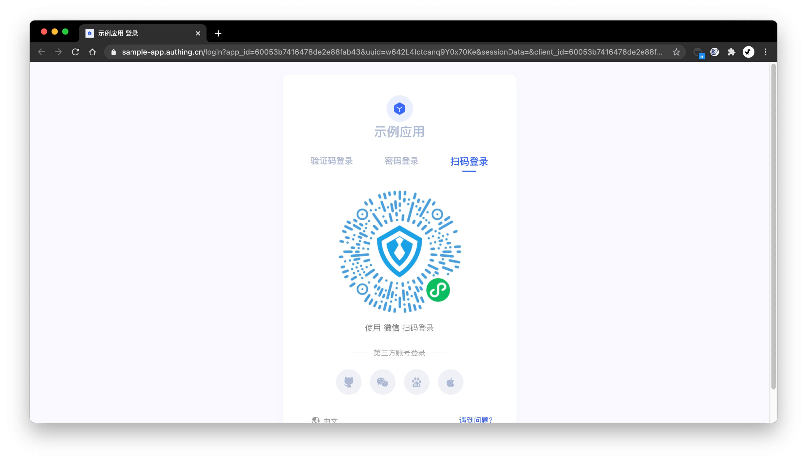

You can enable the Mini Program QR code login on the registration and login configuration page of the application details:

Click Save, and a Mini Program QR code login tab will be added to the login page:

You can use the WeChat APP to scan the QR code to log in.