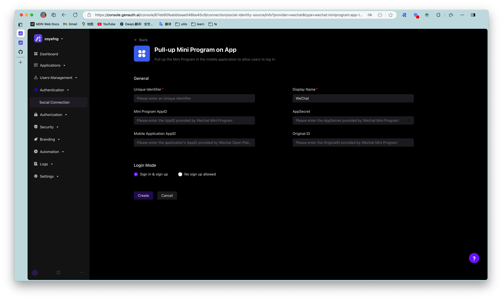

# When you use the mobile WeChat application for development

<LastUpdated/>

## WeChat Open Platform Preparation

### Register a WeChat Open Platform Account

Before developing WeChat ecosystem applications, you must first register as a developer of the WeChat Open Platform. If you do not have a WeChat Open Platform account, please [go to register](https://open.weixin.qq.com/wxaopen/regist/index).

### Apply for developer qualification certification

After completing the WeChat Open Platform account registration, you need to fill in the developer qualification certification application in the **Account Center** and wait for the certification to pass.

### Launch your mobile app
  
#### Step 1: Create a mobile app

1. After logging in to your [WeChat Open Platform](https://open.weixin.qq.com/), click **Create Mobile App** under **Admin Center->Mobile App**.

2. Fill in "Fill in basic information", "Fill in platform information" in turn, and "Submit successfully".

#### Step 2: Submit your mobile app for review

After creating the app, you need to submit it to WeChat for review. To ensure that it is easier to pass the review, please read and comply with WeChat's [Application Review Specifications](https://developers.weixin.qq.com/doc/oplatform/Website_App/operation.html) in advance.

#### Step 3: Wait for WeChat official review to go online

After waiting for WeChat official review to pass, when you open your WeChat mobile app, you will see the application with the status of "Reviewed".

## Implement WeChat login capability in {{$localeConfig.brandName}}

### Developer scenarios for using WeChat login

You want to implement WeChat login capability on mobile devices by creating a WeChat application. According to the above steps, you have completed the creation of the WeChat application. Next, you do not have to read the massive and complicated WeChat documents, but can directly implement WeChat login for your application through {{$localeConfig.brandName}} "zero code" method.

### Choose the right WeChat login method

In the "mobile application" development scenario, {{$localeConfig.brandName}} supports both WeChat login capabilities in the WeChat ecosystem:

* WeChat mobile

* APP launches mini program

### Configuration process

To configure the mobile WeChat login method, follow the following process:

#### Step 1: Integrate the application that needs to configure WeChat login in {{$localeConfig.brandName}}

To integrate your application in {{$localeConfig.brandName}}, please refer to [Connect your application to {{$localeConfig.brandName}}](/guides/app-new/create-app/README.md).

#### Step 2: Create WeChat login method in your {{$localeConfig.brandName}} user pool

{{$localeConfig.brandName}} supports 20+ third-party account login methods. You can view all the identity providers supported by {{$localeConfig.brandName}} in [Connecting to an External Identity Provider](/guides/connections/README.md).

* Configure WeChat mobile login:  WeChat mobile login allows your users to log in to third-party applications securely using their WeChat identity. After enabling WeChat mobile login in {{$localeConfig.brandName}}, users can call up WeChat to obtain WeChat user identity information when logging in using the app. For detailed configuration process, see [WeChat mobile](/guides/connections/social/wechat-mobile/README.md).

* Configure APP to launch the mini program to log in: After enabling APP to launch the mini program in {{$localeConfig.brandName}}, users can call up the mini program when logging in with the APP, thereby obtaining the official real-name user information of WeChat. Users can complete registration or login with their real number with one-click authorization. For detailed configuration process, see [APP launches WeChat mini program](/guides/connections/social/wechat-miniprogram-applaunch/README.md).

#### Step 3: Enable the WeChat login method you configured for the integrated {{$localeConfig.brandName}} application

After completing the third-party login configuration, enable the corresponding login method in the application you have integrated:

Congratulations! You have completed the WeChat login configuration. Now you can experience the WeChat login you implemented in the "Experience Login" of the application!

## Daily account management of WeChat application

User accounts on the WeChat platform use `OpenID` and `UnionID` as unique identifiers. Since WeChat did not require all applications to join the WeChat Open Platform in the early years, some accounts do not have `Unionid`. Later WeChat specifications require that all applications must rely on the WeChat Open Platform. Users who log in through apps created by WeChat Open Platform have both `OpenID` and `UnionID` as unique identifiers. For the difference between the two, please refer to [Introduction to WeChat Ecosystem Account System](/guides/wechat-ecosystem/#localeconfig-brandname-微信生态账号系统).

Based on WeChat's account system, there are two scenarios when your users log in through WeChat:

* New users log in through WeChat

* Old users log in through WeChat

For different scenarios of new and old users logging in, {{$localeConfig.brandName}} supports the "account binding" function to ensure the uniqueness of your users' accounts in {{$localeConfig.brandName}}.

For an introduction to the "account binding" function and usage details, please refer to [account binding](/guides/connections/account-binding.md).

## Other notes

When your app on WeChat Open Platform has been offline or deactivated, the app you integrated in {{$localeConfig.brandName}} will no longer be able to log in using WeChat.