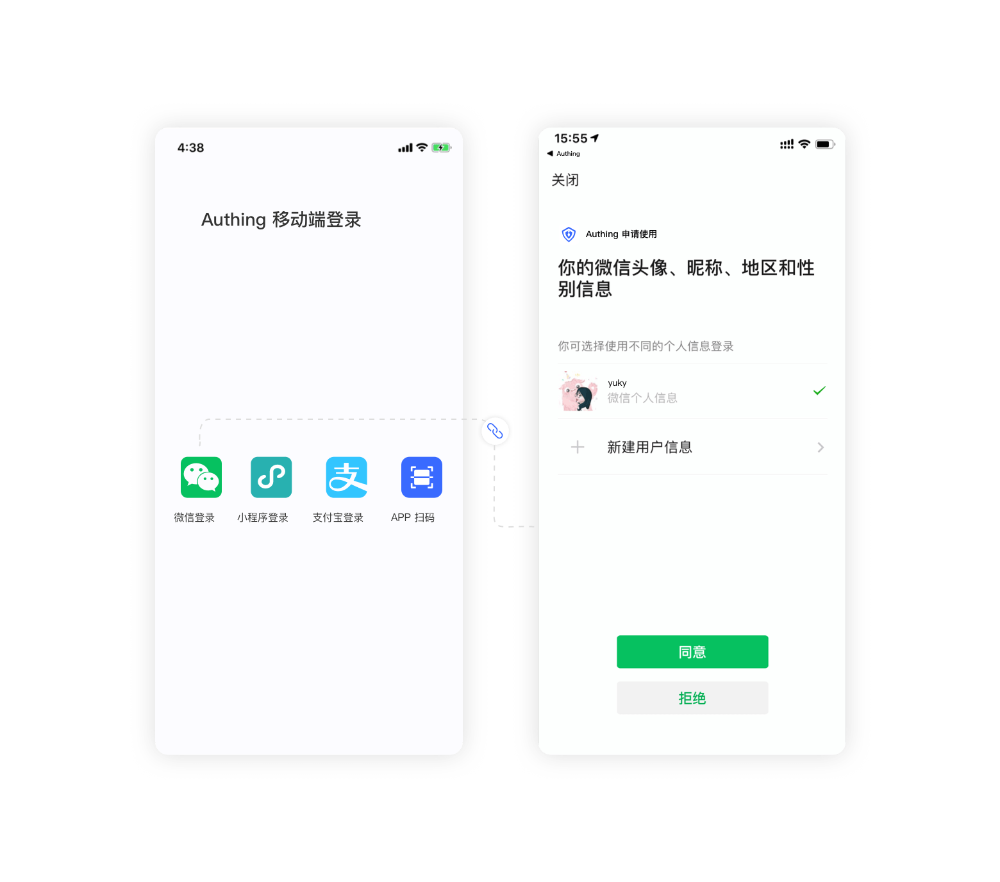

# Mobile APP uses WeChat login

<LastUpdated/>

{{$localeConfig.brandName}} provides developers with a way to quickly jump to WeChat login and obtain user information in mobile (iOS or Android) applications. WeChat account access can be completed by simply calling {{$localeConfig.brandName}} mobile SDK.

- Application scenario: mobile APP;
- Overview: Launch WeChat APP in mobile application to log in;
- View [Official WeChat Document](https://developers.weixin.qq.com/doc/oplatform/Mobile_App/WeChat_Login/Development_Guide.html)



## Step 1: Create a WeChat mobile application on WeChat Open Platform

Please go to [WeChat Open Platform](https://open.weixin.qq.com/cgi-bin/frame?t=home/app_tmpl&lang=zh_CN) to create a WeChat mobile application. You need to record the application's **App ID** and **App Secret**, which will be used later.

## Step 2: Configure WeChat mobile app in {{$localeConfig.brandName}} console

On the social login configuration page of the console, find the **WeChat mobile terminal** application and fill in the following configuration:

- AppID: WeChat mobile application ID;
- AppSecret: WeChat mobile application key.

After the configuration is completed, please click "OK" to save the information.

## Step 3: Start development access

### Configure iOS Universal Links

> Starting from WeChat WechatOpenSDK 1.8.6, iOS mobile applications need to fill in Universal Links information. If you are developing an Android application or have already configured it, you can skip this section. [See Apple's official document here](https://developer.apple.com/documentation/uikit/inter-process_communication/allowing_apps_and_websites_to_link_to_your_content/enabling_universal_links).

#### Configure apple-app-site-association file

Find your Team ID on the **Membership** page of the Apple Developer console:


Find the Bundle Identifier in Xcode **Targets** -> **Signing & Capabilities**:


Next, create the apple-app-site-association file:

Assuming your Team ID is xxxxxxx, Bundle Identifier is com.example.exampleApp, and set the Path of Universal Link to `/native/*`, the apple-app-site-association is as follows:

Assuming your Team ID is xxxxxxx, Bundle Identifier is com.example.exampleApp, and set the Path of Universal Link to If the domain name is `/native/*`, the apple-app-site-association is as follows:

```json
{
  "applinks": {
    "apps": [],
    "details": [
      {
        "appIDs": ["xxxxxxx.com.example.exampleApp"],
        "paths": ["/native/*"]
      }
    ]
  }
}
```

You need to deploy this file to the .well-known/apple-app-site-association link of your domain name. If your domain name is example.com, you need to access the file through https://example.com/.well-known/apple-app-site-association. The following points need to be noted:

- **Must use https**
- apple-app-site-association needs to be a valid JSON file, but **without the .json suffix**.
- content-type needs to be set to application/json
- Please **use the \* wildcard** for paths, as required by WeChat.

The following is an example of nginx configuration: (here, put the apple-app-site-association file in a .well-known folder)

```nginx
server {
  listen 80;
  listen 443 ssl;

  server_name genauth.ai;

  ssl_certificate /mnt/cerm/client/1_genauth.ai_bundle.crt;
  ssl_certificate_key /mnt/cerm/client/2_genauth.ai.key;
  ssl_session_timeout 5m;
  ssl_ciphers ECDHE-RSA-AES128-GCM-SHA256:ECDHE:ECDH:AES:HIGH:!NULL:!aNULL:!MD5:!ADH:!RC4;
  ssl_protocols TLSv1 TLSv1.1 TLSv1.2;
  ssl_prefer_server_ciphers on;


  location /.well-known {
    alias /path/to/your/.well-known/folder;
    try_files $uri $uri/ =404;
  }
}
```

#### Configure Associated Domains in Xcode

Next, configure Associated Domains in Xcode. In Xcode **Targets** -> **Signing & Capabilities** page, click **+Capability** :


Select Associated Domains:


Assuming your domain name is example.com, fill in `applinks:example.com` :


#### Verify that Universal Links are effective

Assuming your domain name is example.com, and the Path is `/native/*`, after installing your App on your phone, use the Safari browser to visit `https://example.com/native/`, and pull the web page online, you should be able to see your App:


Visit `https://example.com/native/xxx` again, and you can still see it.

#### Fill in Universal Links in WeChat Open Platform


### Access WechatOpenSDK

Please follow the [WeChat official document](https://developers.weixin.qq.com/doc/oplatform/Mobile_App/Access_Guide/iOS.html) to access WechatOpenSDK. If you encounter any problems, here is a Swift Demo App for developers to refer to: [https://github.com/authing/AuthingIOSDemo](https://github.com/authing/AuthingIOSDemo) .

### Initiate a login request

After successfully accessing the SDK, you should be able to successfully open WeChat to obtain user authorization and obtain the authorization code:

The following is a code example for initiating a WeChat login request (Swift):

```swift
func loginByWechat() {
    let req = SendAuthReq()
    req.scope = "snsapi_userinfo" //Get user information
    req.state = "123" //Random value is fine, here use timestamp
    WXApi.send(req)
}
```

You can get the authorization code in the onResp method of AppDelegate or SceneDelegate, as shown below:


### Receive WeChat callback data to get code

Here is a sample code (Swift language):

```swift
func onResp(_ resp: BaseResp) {

    debugPrint(resp)

    // WeChat login request information
    if resp.isKind(of: SendAuthResp.self) {
        if resp.errCode == 0 && resp.type == 0{
            let response = resp as! SendAuthResp

            // WeChat authorication_code
            let code = response.code
            debugPrint("code: " ,code)
        }
    }
}
```

### Exchange for user information

After the user agrees to receive `code`, you can call the `loginByWeChatCode` method of [Swift SDK](/reference/sdk-for-swift.md) to obtain user information:

```swift
func loginByWeChatCode() {
    let code = "code"
    // Normal
    self.client?.loginByWeChatCode(code: code, completion: { status in
        print(status)
    })
}
```

## Next

!!!include(common/what-to-do-when-you-get-userinfo.md)!!!
