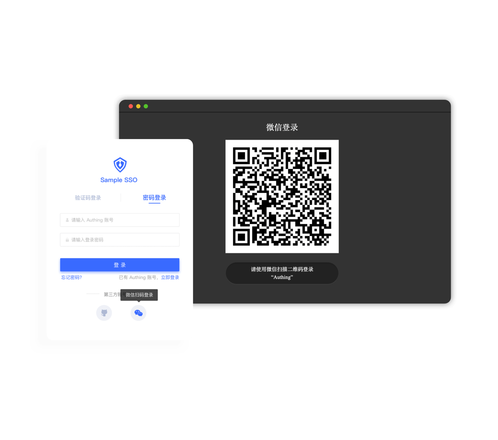

# PC website uses WeChat QR code login

<LastUpdated/>

PC WeChat QR code login allows users to use WeChat identity to log in to third-party applications or websites securely. After enabling WeChat QR code login in {{$localeConfig.brandName}}, you can quickly obtain WeChat user basic open information and help users realize basic open functions through {{$localeConfig.brandName}}.

- Application scenario: PC website;
- Overview: Jump to the WeChat QR code page in the PC website application, and then use WeChat QR code to log in to the application;
- View [WeChat official documentation](https://developers.weixin.qq.com/doc/oplatform/Website_App/WeChat_Login/Wechat_Login.html).

## Sample code

You can get the sample code here: [https://github.com/Authing/wechat-eco-solution](https://github.com/Authing/wechat-eco-solution).

## Step 1: Create a website application on WeChat Open Platform

Please follow the instructions on [WeChat Open Platform](https://open.weixin.qq.com/cgi-bin/frame?t=home/web_tmpl&lang=zh_CN) to create a WeChat website application. You need to record the application's **App ID** and **App Secret**, which will be used later. Please make sure that the application has obtained the **WeChat login** permission and set the authorization callback domain to `core.genauth.ai`.

## Step 2: Configure the WeChat QR code scanning application in the {{$localeConfig.brandName}} console

On the social login configuration page of the console, find the **PC WeChat QR code scanning login** application and fill in the following configuration:

- `App ID`: WeChat application ID;
- `App Secret`: WeChat application key;
- `Callback URL`: **This is your business callback domain name, which is not the same as the callback link configured for self-built applications, and has nothing to do with the callback address configuration of the third-party social login console**. For example, if your website domain name is `https://example.com`, and the url for processing the {{$localeConfig.brandName}} callback request is `/auth/callback`, then you should fill in `https://example.com/auth/callback`. This parameter is no longer recommended. It is recommended to configure the callback link separately in the application. The address here can be filled in `#``.

## Step 3: Start developing access

{{$localeConfig.brandName}} Social login supports four access methods: **Using JavaScript SDK**, **Using embedded login component**, **Using hosted login page** and **Manually calling social login interface**. Each different access method has its own advantages and disadvantages. You can choose the appropriate method according to your business needs.

The following is a comparison of the advantages and disadvantages of various methods:

| Access method                            | Advantages                                                                                                                                        | Disadvantages                                                                                                                                                                                                                                              | Is it recommended |
| ---------------------------------------- | ------------------------------------------------------------------------------------------------------------------------------------------------- | ---------------------------------------------------------------------------------------------------------------------------------------------------------------------------------------------------------------------------------------------------------- | ----------------------------------------------------------- |
| Using JavaScript SDK                     | Easy access, only a few lines of code are needed. Highest degree of customization.                                                                |                                                                                                                                                                                                                                                            | Yes                                                         |
| Using embedded login component           | Easy access, only a few lines of code are needed. This component can be integrated into your application. Relatively high degree of customization |                                                                                                                                                                                                                                                            | Yes                                                         |
| Use hosted login page                    | Simple operation and maintenance, which is handled by {{$localeConfig.brandName}}. Each user pool has an independent second-level domain name.    | If you need to embed it in your application, you need to use the pop-up mode to log in, that is: after clicking the login button, a window will pop up with the login page hosted by GenAuth, or redirect the browser to the login page hosted by GenAuth. | Yes                                                         |
| Manually call the social login interface |                                                                                                                                                   | You need to manually parse the user information from the URL. Access is relatively complicated and troublesome.                                                                                                                                            | Not recommended                                             |

<StackSelector snippet="social-login" selectLabel="Select access method" :order="['sdk', 'embeded-component', 'hosted-page', 'manually']"/>

## Next

!!!include(common/what-to-do-when-you-get-userinfo.md)!!!
