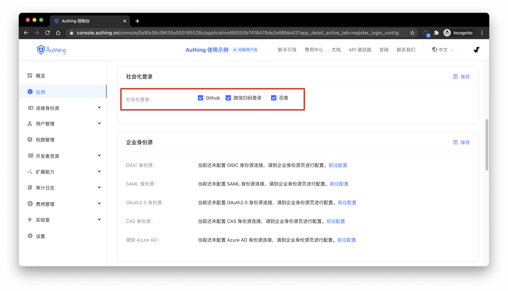
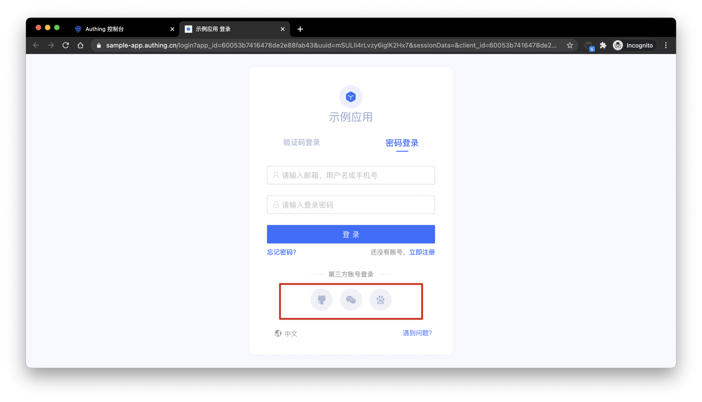

You can configure the social login for the application in the social login item of the registration and login configuration of the application details:

Click Save, and the login page will only display the enabled social login:

