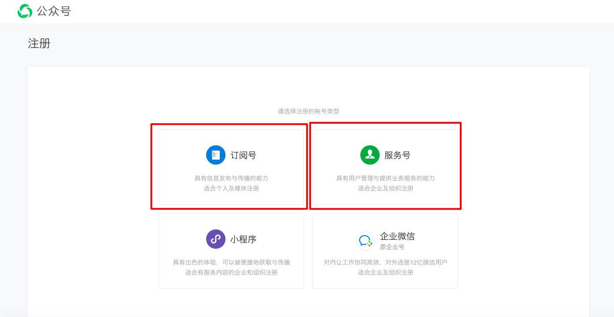
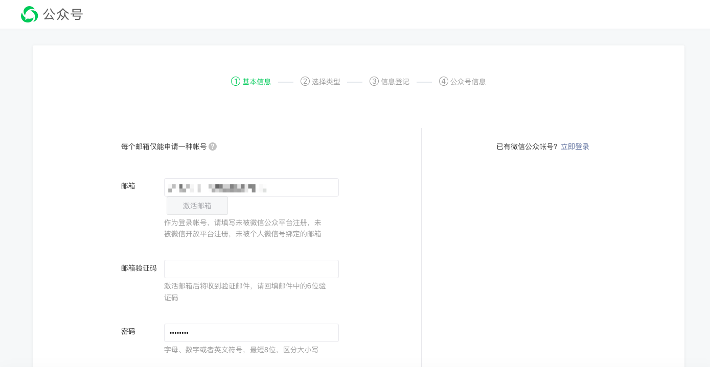
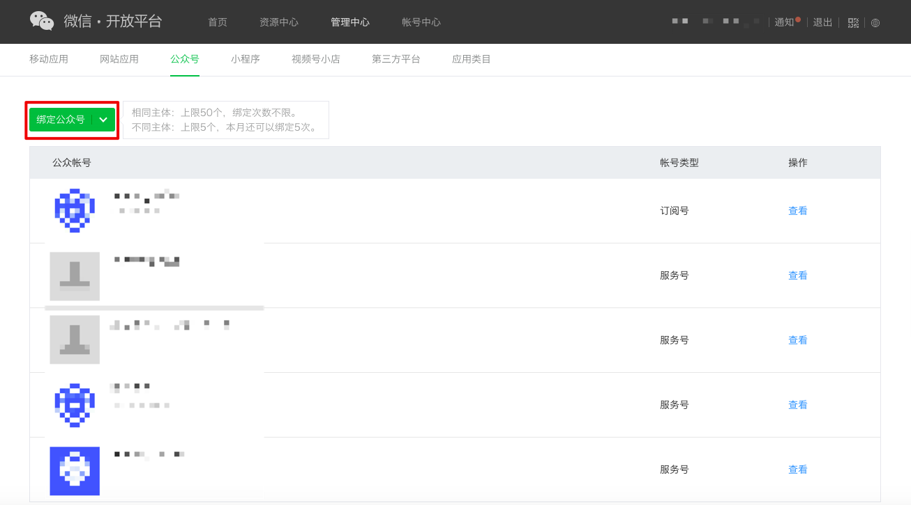
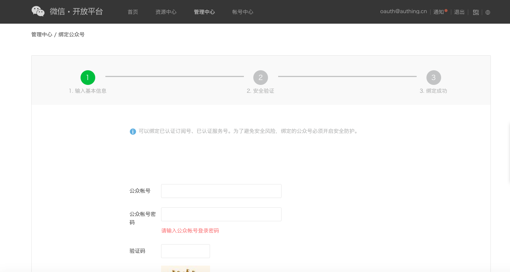
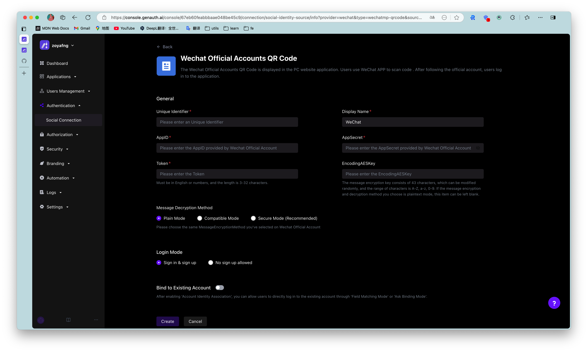
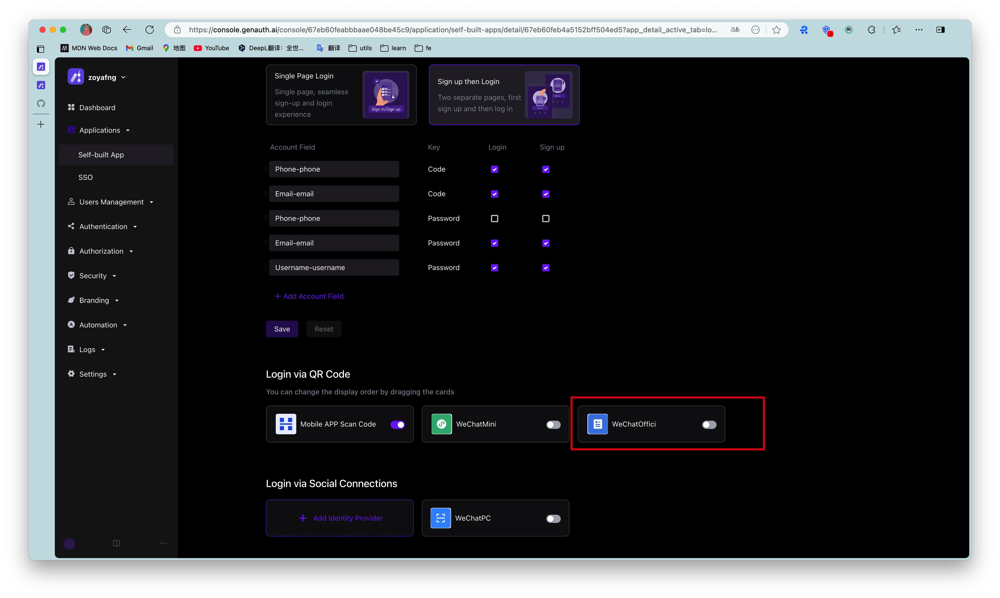

# When you use WeChat official account for development

<LastUpdated/>

## WeChat Open Platform preparation

### Register WeChat Open Platform account

Before developing WeChat ecosystem applications, you must first register as a developer of WeChat Open Platform. If you do not have a WeChat Open Platform account, please [go to register](https://open.weixin.qq.com/wxaopen/regist/index).

### Apply for developer qualification certification

After completing the WeChat Open Platform account registration, you need to fill in the developer qualification certification application in **Account Center** and wait for the certification to pass.

### Launch your WeChat public account
  
#### Step 1: Create a WeChat public account

1. Before creating a public account, you need to [register an account on the WeChat public platform](https://mp.weixin.qq.com/cgi-bin/registermidpage?action=index&lang=zh_CN&token=) and select the type as **Subscription account** / **Service account**.

2. Fill in "Basic Information", "Select Type", "Information Registration", and "Public Account Information" in turn to complete the registration.

3. After successful registration, the public account is created successfully.

#### Step 2: Bind WeChat public account

After creating a public account, you need to bind the public account on the WeChat Open Platform to ensure that you have a unique `UnionID` when logging into different applications under the same WeChat Open Platform account. ​

1. After logging in to your [WeChat Open Platform](https://open.weixin.qq.com/), click **Bind Public Account** under **Admin Center->Public Account**.

2. Complete "Enter basic information", "Security verification", and "Bind successfully" in sequence.

## Implement WeChat login capability in {{$localeConfig.brandName}}

### Developer scenarios using WeChat login

You want to implement the WeChat login capability on the web by creating a WeChat application. According to the above steps, you have completed the creation of the WeChat application. Next, you don't have to read a lot of complicated WeChat documents, but can directly implement WeChat login for your application through {{$localeConfig.brandName}} "zero code" method.

### Choose the appropriate WeChat login method

In the development scenario of "WeChat public account", {{$localeConfig.brandName}} supports [WeChat public account follow](/guides/connections/social/wechatmp-qrcode/README.md) login capability.

### Configuration process

To configure WeChat official account login, follow the process below:

#### Step 1: Integrate the application that needs to configure WeChat login in {{$localeConfig.brandName}}

Currently, only web applications support WeChat official account login. Please refer to [Connect your application to {{$localeConfig.brandName}}](/guides/app-new/create-app/README.md).

#### Step 2: Create WeChat login in your {{$localeConfig.brandName}} user pool

{{$localeConfig.brandName}} supports 20+ third-party account login methods. You can view all identity sources supported by {{$localeConfig.brandName}} in [Connecting external identity sources (Identity Provider)](/guides/connections/README.md).

Configure WeChat official account follow login:

WeChat official account login allows your users to use WeChat identity to securely log in to the mini program. Display the WeChat public account QR code on the PC website, scan the code with WeChat APP, and follow the public account to achieve automatic login. For the configuration process, see [WeChat public account follow](/guides/connections/social/wechatmp-qrcode/README.md).

#### Step 3: Enable the WeChat login method you configured for the integrated {{$localeConfig.brandName}} application

After completing the third-party login configuration, enable the corresponding login method in the application you have integrated:

Congratulations! You have completed the WeChat login configuration. Now you can experience the WeChat login you implemented in the "Experience Login" of the application!

## Daily account management of WeChat applications

User accounts on the WeChat platform use `OpenID` and `UnionID` as unique identifiers. Since WeChat did not require all applications to join the WeChat Open Platform in the early years, some accounts did not have `Unionid`. Later WeChat regulations required that all applications must rely on the WeChat Open Platform. Users who log in to these applications created by the WeChat Open Platform have both `OpenID` and `UnionID` as unique identifiers. For the difference between the two, please refer to [Introduction to WeChat Ecosystem Account System](/guides/wechat-ecosystem/#localeconfig-brandname-微信生态账号系统).

Based on the WeChat account system, there are two scenarios when your users log in through WeChat:

* New users log in through WeChat

* Old users log in through WeChat

For different scenarios of new and old users logging in, {{$localeConfig.brandName}} supports the "account binding" function to ensure the uniqueness of your users' accounts in {{$localeConfig.brandName}}.

For an introduction to the "Account Binding" function and usage details, please refer to [Account Binding](/guides/connections/account-binding.md).

## Other Notes

When your application on WeChat Open Platform has been offline or disabled, the application you integrated in {{$localeConfig.brandName}} will no longer be able to log in using WeChat.