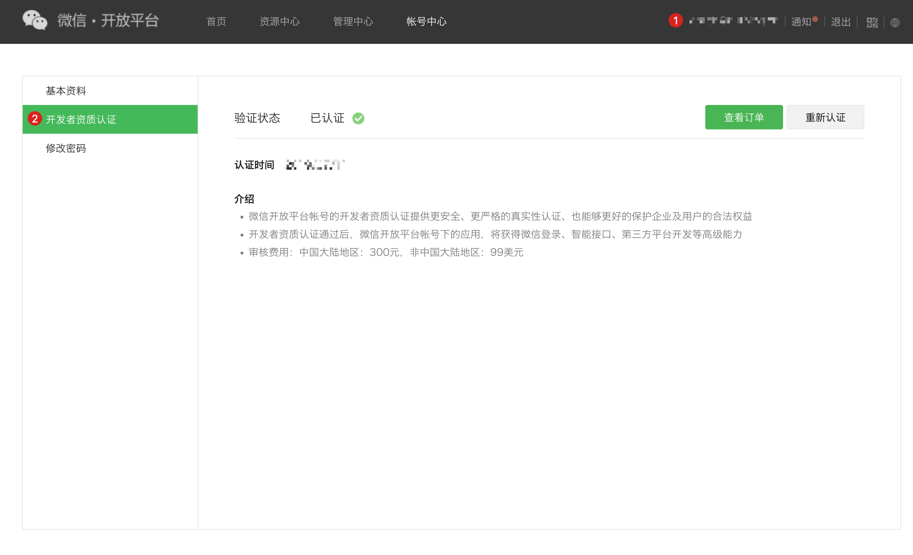

# When you use the web version of WeChat application for development

<LastUpdated/>

## WeChat Open Platform preparation

### Register a WeChat Open Platform account

Before developing WeChat ecosystem applications, you must first register as a developer of WeChat Open Platform. If you do not have a WeChat Open Platform account, please [go to register](https://open.weixin.qq.com/wxaopen/regist/index).

### Apply for developer qualification certification

After completing the WeChat Open Platform account registration, you need to fill in the developer qualification certification application in **Account Center** and wait for the certification to pass.

### Launch your website application
  
#### Step 1: Create a website application

1. After logging in to your [WeChat Open Platform](https://open.weixin.qq.com/), follow the steps below to find **Create a website application**:

2. Fill in "Fill in basic information", "Fill in website information", and "Submit successfully".

#### Step 2: Submit your website application for review

After completing the creation of the application, you need to submit the application to WeChat official for review. To ensure that it is easier to pass the review, please read and comply with WeChat's [Application Review Specifications](https://developers.weixin.qq.com/doc/oplatform/Website_App/operation.html) in advance.

#### Step 3: Go online after WeChat official review

After waiting for WeChat official review to pass, when you open your WeChat website application, you will see an application with the status of "Reviewed", as shown in the figure below:

## Implement WeChat login capability in {{$localeConfig.brandName}}

### Developer scenarios for using WeChat login

You want to implement the ability to log in to WeChat on the web by creating a WeChat application. According to the above steps, you have completed the creation of the WeChat application. Next, you don't have to read the massive and complicated WeChat documents anymore, but can directly implement WeChat login for your application through {{$localeConfig.brandName}} "zero code" method.

### Choose the right WeChat login method

In the "web application" development scenario, {{$localeConfig.brandName}} supports both WeChat login capabilities in the WeChat ecosystem:

* PC WeChat QR code login

* PC mini program QR code login

In addition, for web applications, {{$localeConfig.brandName}} also supports WeChat public account QR code login. You first need to make corresponding configurations on the WeChat public platform. For details, please see [When you use WeChat public account for development](/guides/wechat-ecosystem/wechat-public-account-app.md).

### Configuration process

To configure WeChat login on the web, follow the process below:

#### Step 1: Integrate the application that needs to be configured with WeChat login in {{$localeConfig.brandName}}

For how to integrate your application in {{$localeConfig.brandName}}, please refer to [Connect your application to {{$localeConfig.brandName}}](/guides/app-new/create-app/README.md).

#### Step 2: Create WeChat login method in your {{$localeConfig.brandName}} user pool

{{$localeConfig.brandName}} supports 20+ third-party account login methods. You can view all identity sources supported by {{$localeConfig.brandName}} in [Connecting external identity sources (Identity Provider)](/guides/connections/README.md).

* Configure PC WeChat scan code login: PC WeChat scan code login allows your users to log in to third-party applications or websites securely using WeChat identity. After enabling WeChat QR code scanning login in {{$localeConfig.brandName}}, you can quickly obtain WeChat user basic open information and help users realize basic open functions through {{$localeConfig.brandName}}. For the configuration process, see [PC WeChat QR code scanning](/guides/connections/social/wechat-pc/README.md).

* Configure PC mini program QR code scanning login: This is a groundbreaking design of {{$localeConfig.brandName}}. After enabling scanning mini program QR code login in {{$localeConfig.brandName}}, you can obtain WeChat official real-name user information. Users can complete registration or login with real numbers with one-click authorization, and establish an account system based on mobile phone numbers for developers. For the configuration process, please refer to [WeChat PC Mini Program Scan Code](/guides/connections/social/wechat-miniprogram-qrconnect/README.md).

#### Step 3: Enable the WeChat login method you configured for the integrated {{$localeConfig.brandName}} application

After completing the third-party login configuration, enable the corresponding login method in the application you have integrated:

Congratulations! You have completed the WeChat login configuration. Now you can experience the WeChat login you implemented in the "Experience Login" of the application!

## Daily Account Management of WeChat Application

User accounts on the WeChat platform use `OpenID` and `UnionID` as unique identifiers. Since WeChat did not require all applications to join the WeChat Open Platform in the early years, some accounts do not have `Unionid`. Later WeChat regulations require that all applications must rely on the WeChat Open Platform. Users who log in to these applications created by the WeChat Open Platform have both `OpenID` and `UnionID` unique identifiers. For the difference between the two, please refer to [Introduction to WeChat Ecosystem Account System](/guides/wechat-ecosystem/#localeconfig-brandname-微信生态账号系统).

Based on the WeChat account system, there are two scenarios when your users log in through WeChat:

* New users log in through WeChat

* Old users log in through WeChat

For different scenarios of new and old users logging in, {{$localeConfig.brandName}} supports the "account binding" function to ensure the uniqueness of your users' accounts in {{$localeConfig.brandName}}.

For an introduction to the "account binding" function and usage details, please refer to [account binding](/guides/connections/account-binding.md).

## Other notes

When your application on WeChat Open Platform has been offline or disabled, the application you integrated in {{$localeConfig.brandName}} will no longer be able to log in using WeChat.