# Welink SSO Solution

<LastUpdated/>

Traditional identity systems are often pieced together from various solutions, and "identity data" is separated from each other. The need for unified account management is becoming more frequent and necessary. By using a centralized identity management platform, the user's login experience and IT office efficiency can be greatly improved, and access security can be effectively improved.

We are often asked by developers how to log in to all applications through a single identity source and the same platform, and uniformly perform fine-grained permission management. Taking Welink as an enterprise's single identity source to quickly add Alibaba Cloud as an example, we provide everyone with a very simple solution to unified account management.

## Design ideas

## How to implement

### Step 1: Configure Welink as GenAuth identity source

For specific Welink identity source configuration operations, see the document, [Welink](https://docs.genauth.ai/guides/connections/enterprise/welink/).

### Step 2: Use Welink to single-sign on Alibaba Cloud

### Integrate applications

1. After completing step 1, I believe you have completed the connection of the Welink identity source. Next, select the light application bar under "Enterprise Internal Applications" on the right sidebar of the open platform. Then click "Create Light Application" in the upper right corner to start the application creation process. Fill in the application name and other basic information as shown below to complete the creation.

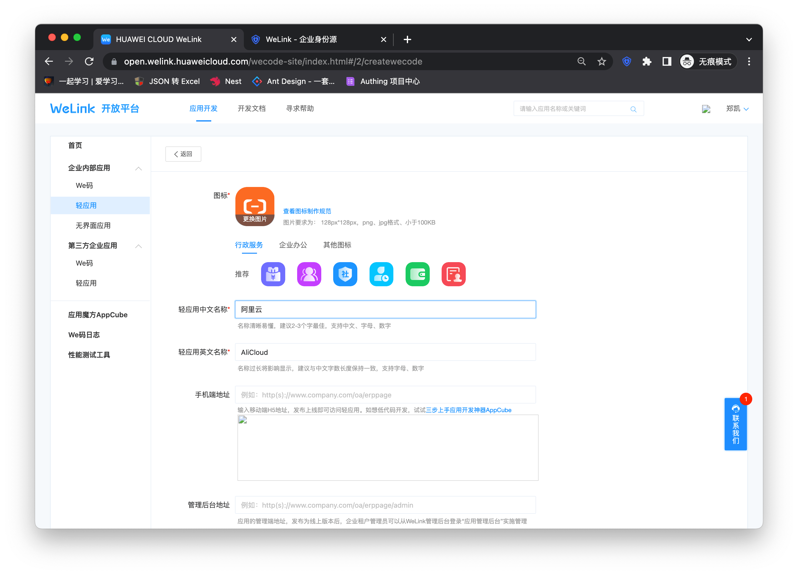

2. The application is created successfully
   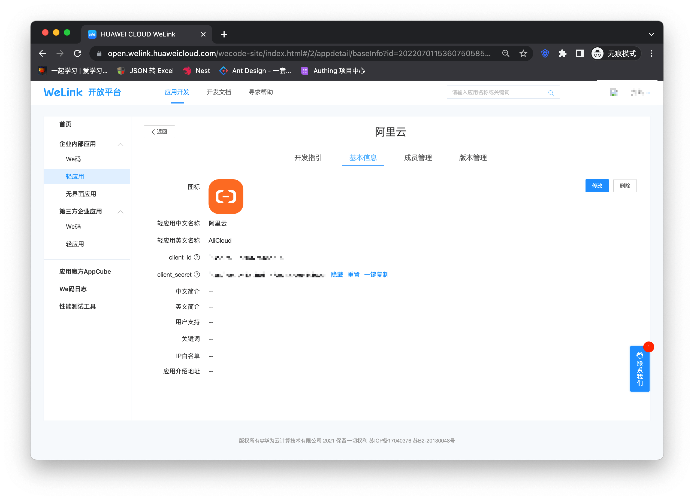

3. Enter the Alibaba Cloud configuration details page and copy the application access link.
   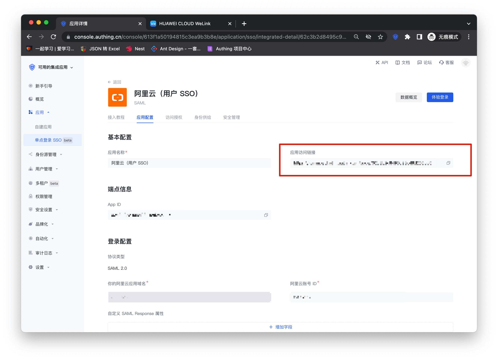

4. Switch the top type, enter the "Version Management" page, click Go to Settings after setting the homepage address, and fill in the link copied above into the PC link in the pop-up window.
   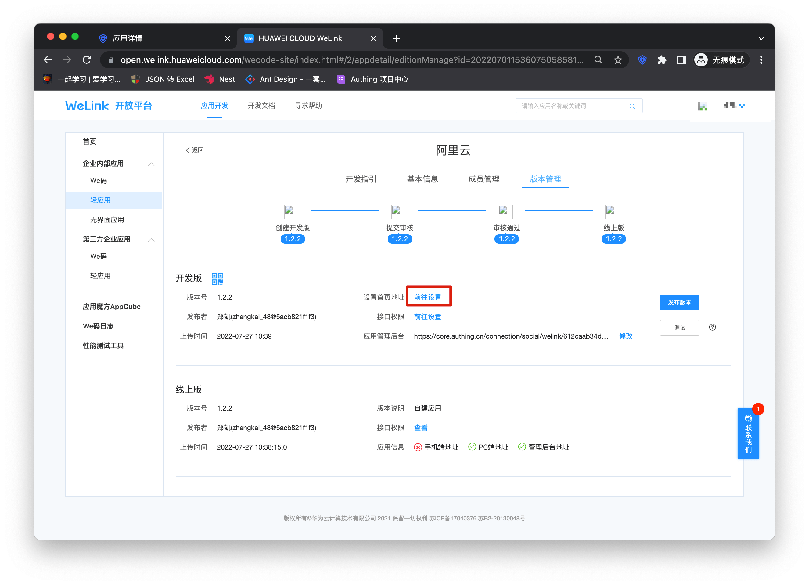
   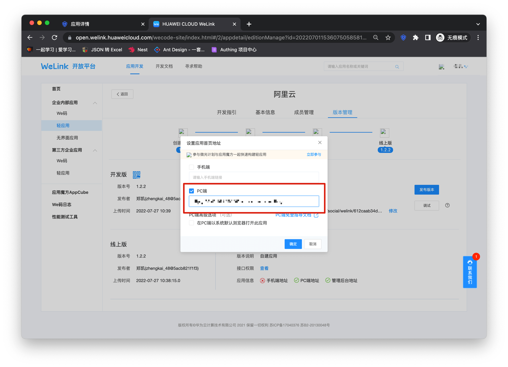

5. Click on the interface permission
   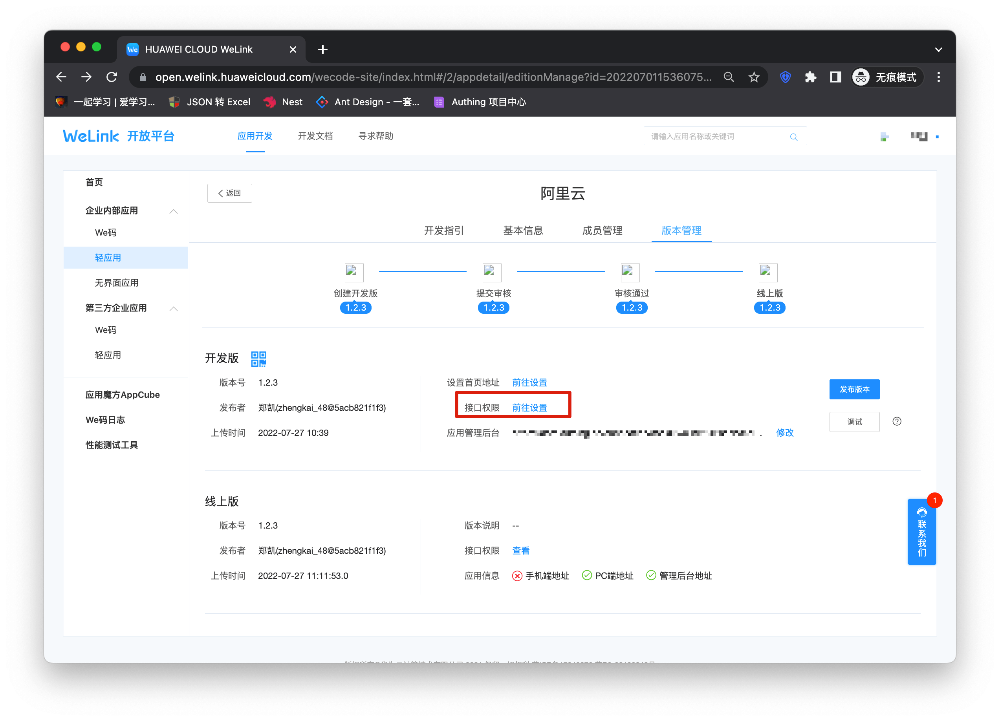

6. Open the user login information and user detailed information permissions on the permission details page.
   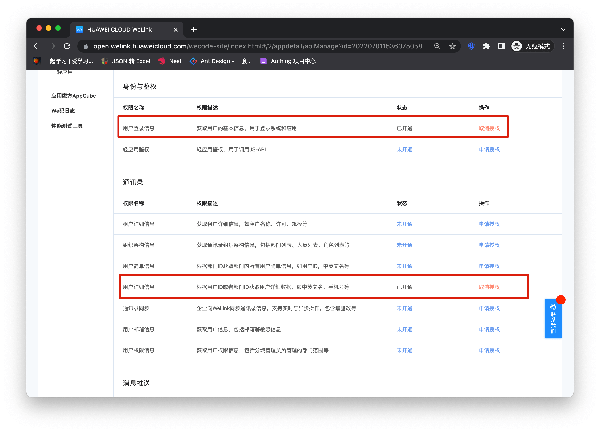

7. Then enter the console and fill in the callback address in the Welink identity source into the application management backend.
   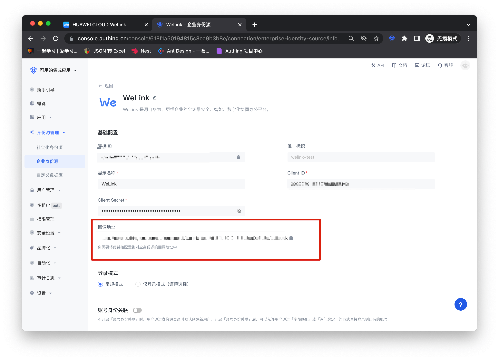
   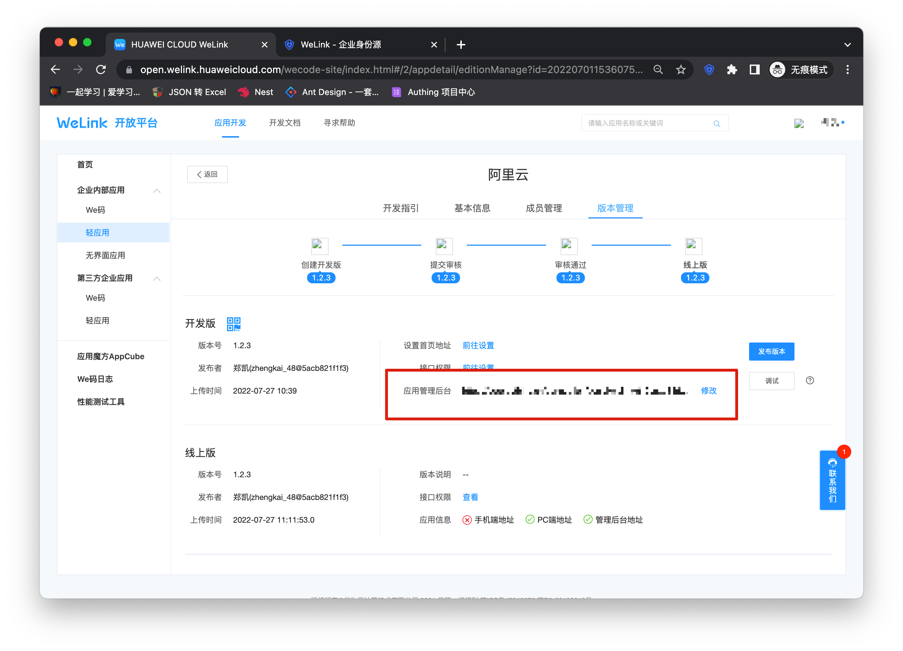

8. Click "Publish Version" and complete the version release according to the process.
   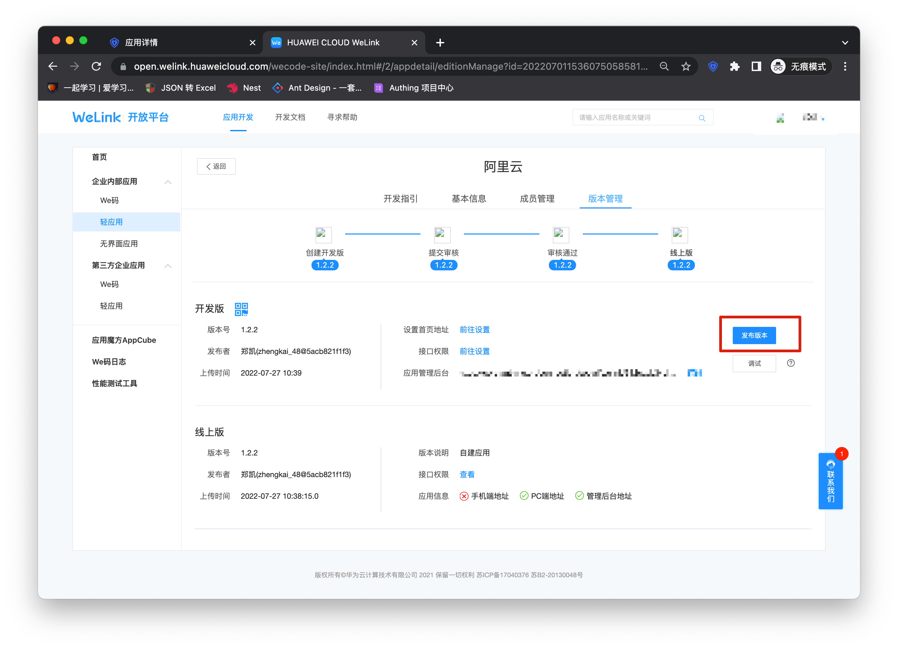
   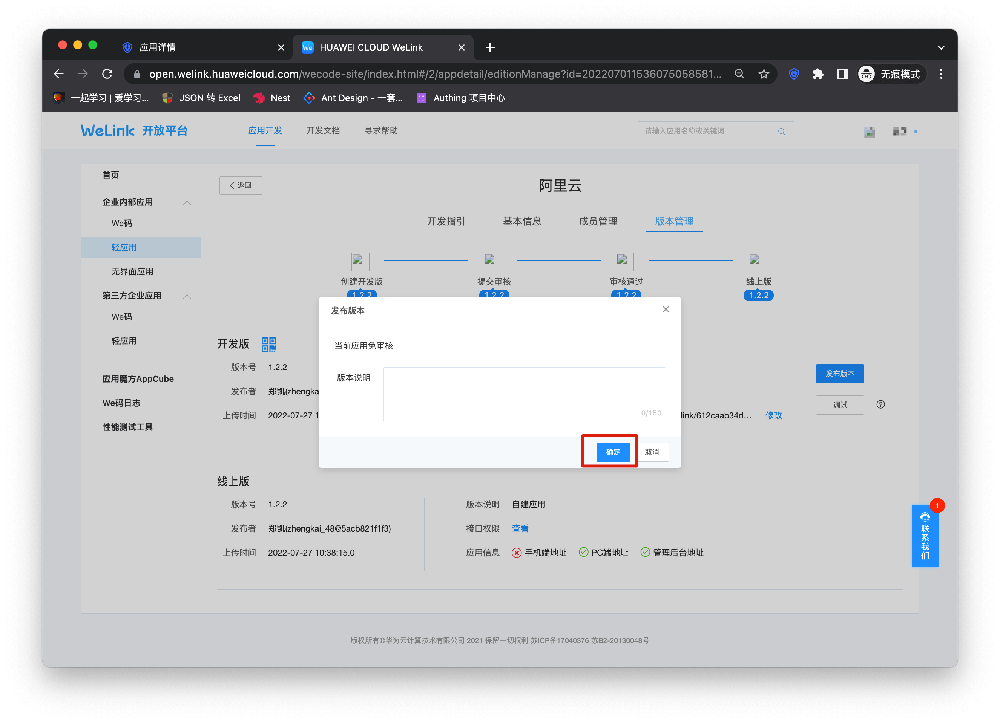

9. At this point, your application has entered the Welink work panel, click to enter.

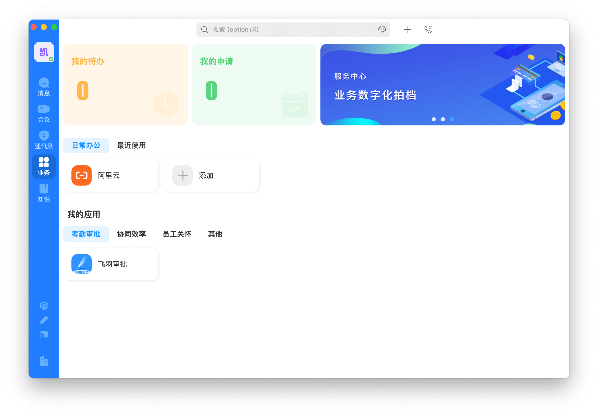

### Self-built application

For self-built applications, you need to perform the following operations:

1. Create a self-built application

> First, you need to create a self-built application and complete the configuration. To create an application, refer to [How to create a self-built application](/guides/app-new/create-app/create-app.md)

2. Users need to enter the configured self-built application details page and copy its authentication address.

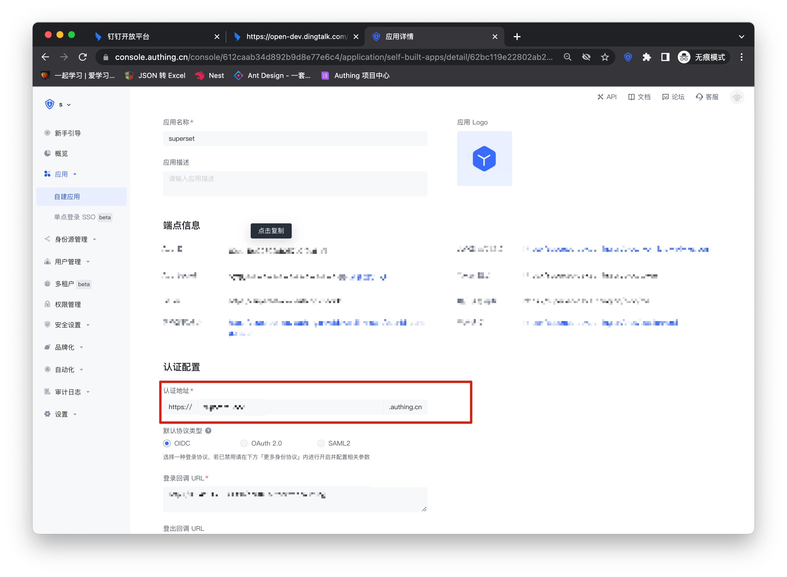

3. Similar to the integrated application, copy the authentication address to the PC link of the homepage address of the version management page. The subsequent steps are the same as the integrated application. After completing the permissions and application management background settings, you can publish the application and use it.

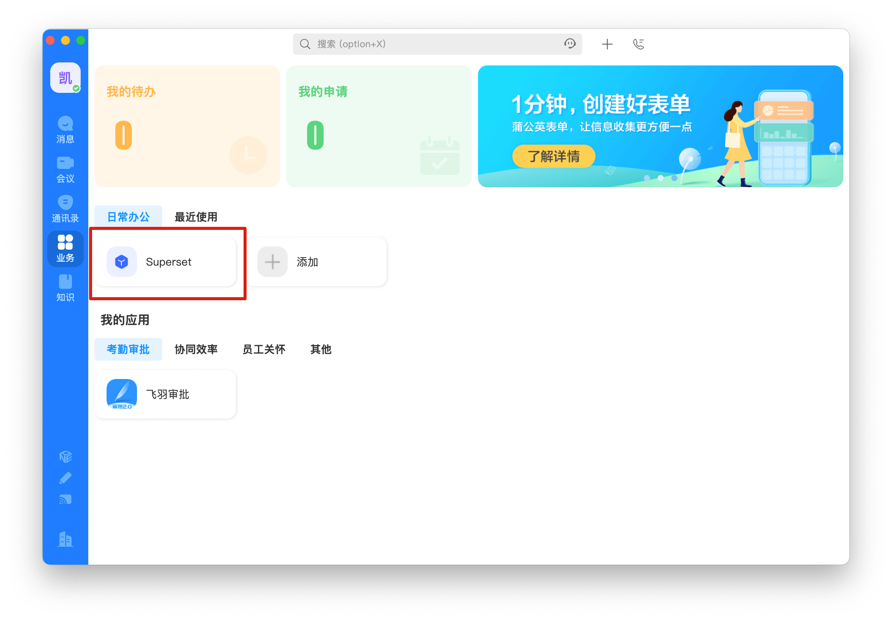
