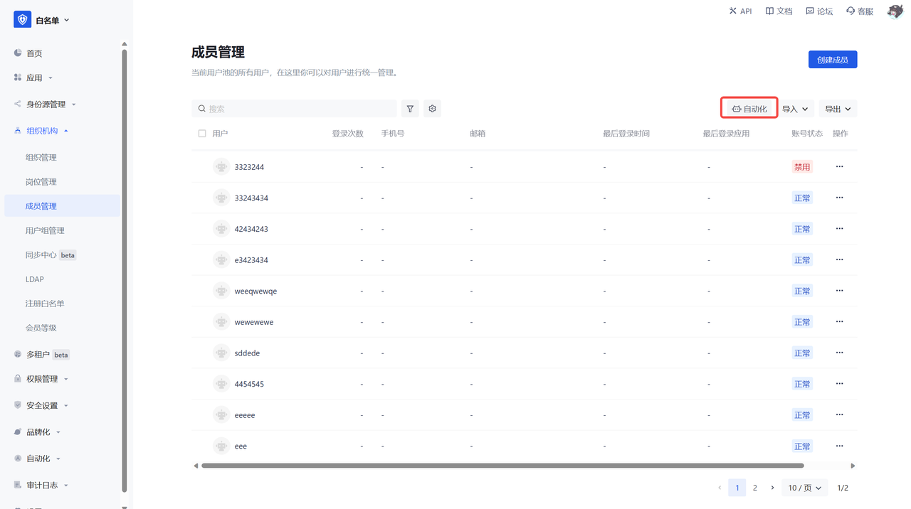
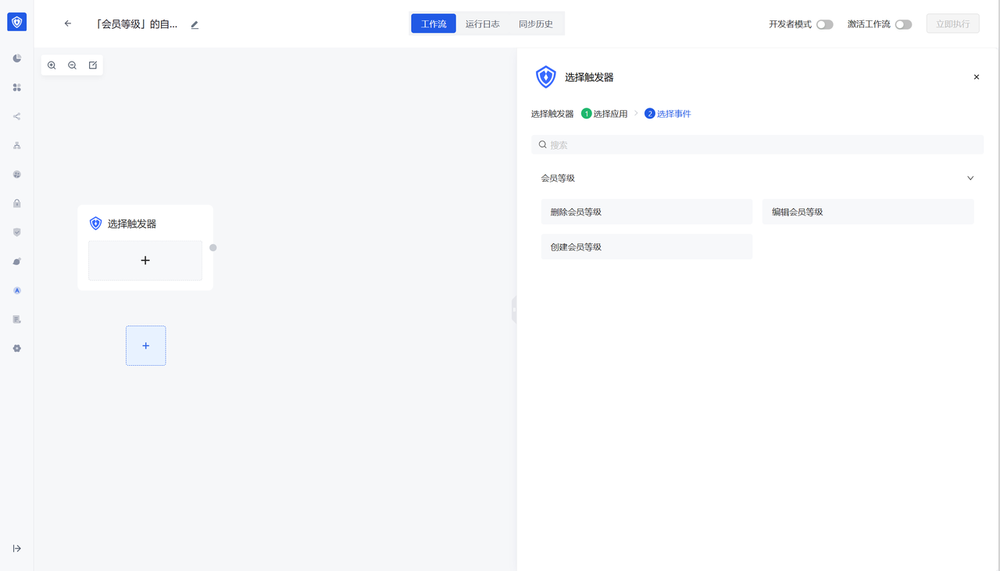

# Metadata Overview

## Overview

GenAuth 3.0 is an event-driven, low-code identity cloud platform. As an enterprise-level identity cloud platform, GenAuth has been exploring how to provide developers with fast and flexible complex function building capabilities. In addition to open APIs, SDKs and automated orchestration engines, GenAuth innovatively provides the first metadata engine based on the identity cloud platform, which helps developers quickly define personalized business rules and business functions through a graphical interface, and provides out-of-the-box users, organizations, user groups, job management, device management, UEBA and other identity domain data models, which are convenient for developers to use out of the box.

At the same time, we provide users with APIs such as creating data objects, querying data object details, and editing data objects, as well as out-of-the-box metadata events such as creating row data/column data, editing row data/column data, and deleting row data/column data. Developers can quickly monitor metadata event changes in the identity automation canvas and link custom operations inside and outside the platform. For example, in an adaptive MFA security scenario, you can use the UEBA metadata model to achieve data linkage monitoring.

Based on GenAuth's powerful identity automation orchestration engine, metadata engine, and full event-driven API, GenAuth truly helps developers achieve identity-based dynamic capability expansion and automated business operations, injecting unlimited creativity and flexibility into enterprise-level software development, thereby achieving a more efficient low-code construction journey, which also brings great agility and rapid response capabilities to GenAuth users, allowing them to calmly respond to rapid changes in market and business needs, and significantly reduce development costs.

## What is metadata

Metadata is information about the organization, data domain and its relationship of data. In simple terms, metadata is used to <strong>describe data</strong>. Generally speaking, it can be divided into: <strong>technical metadata, business metadata, operational metadata, and management metadata</strong>.

## User value of GenAuth metadata

1. Users can customize data objects and publish corresponding function menus. Implement function publishing and menu management.

2. Users can configure which fields are in this function. Field types support common types such as text, numbers, dates, and selections.

3. Users can configure the operation of this function. Implement preset operations such as add, delete, modify, and query.

4. Users can configure the layout of the details page, and can control the field layout and placeholder length by dragging and dropping.

5. Provide the <strong>best domain model in the identity field</strong>. Users can flexibly customize fields and operations for existing functions of the user directory (users, organizations, departments, positions, user groups, and application access control).
6. User-published functions can <strong>automatically publish default events</strong>, and users can configure the workflow of new functions in the <strong>identity automation module</strong>.
7. Provide standard API interface and SDK capabilities

## API address

[Metadata API document address](https://api-explorer.genauth.ai/?tag=tag/%E7%AE%A1%E7%90%86%E5%85%83%E6%95%B0%E6%8D%AE/API%20%E5%88%97%E8%A1%A8/operation/MetaDataController_createModel)

## SDK

3.0.12-alpha.2

## Metadata & Identity Automation

### Detailed description of identity automation module functions:

[Identity Automation Document Address](https://docs.genauth.ai/workflow/overview)

### Metadata & Identity Automation Function Linkage

- Domain models & custom data objects will display automation icons on the list page. Clicking on them will automatically generate a workflow and filter out events related to the data object.
- After a custom data object is created, the events of creating row data & column data, editing row data & column data, and deleting row data & column data will be generated by default.
- Special note: The identity automation portal will only be displayed if you have the identity automation benefit. If you only have the metadata benefit, it will not be displayed.

