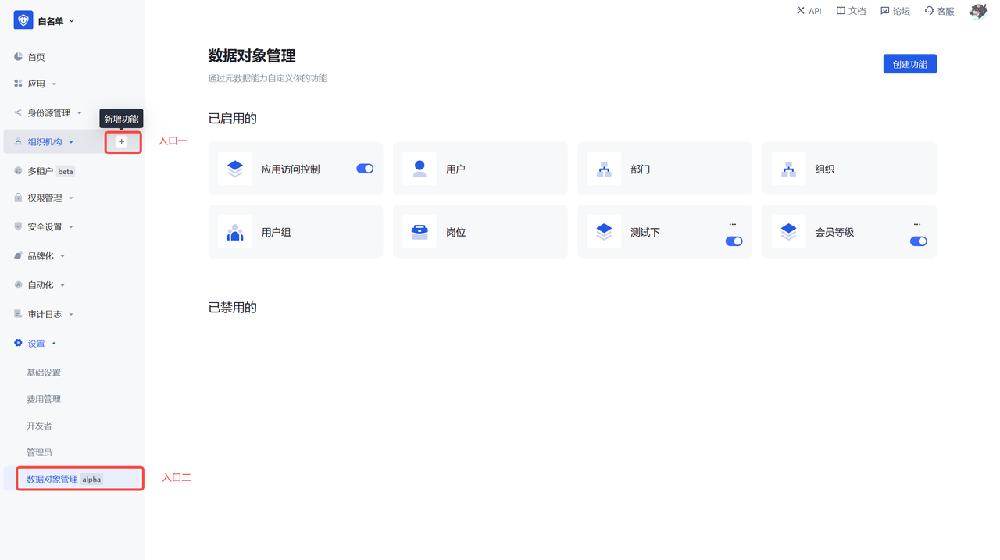
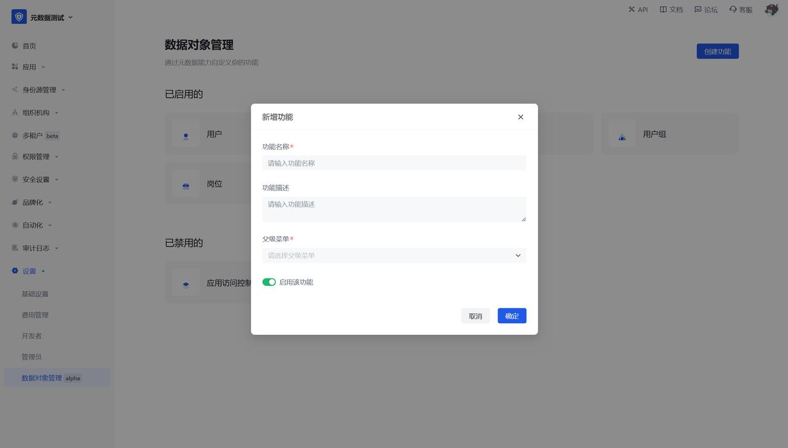

# Function 1: Data object management function entry

## Function description

- Entry 1: Click the Create function on each first-level menu in hover state. The new menu produced will be created under the selected first-level menu by default.
- Entry 2: Settings - Data object management, click Create function, and configure the basic information of the data object.

## User perspective

After this step is configured and <strong>enabled</strong>, a second-level menu will be generated under the selected first-level menu, and the default fields and operations will be displayed.
