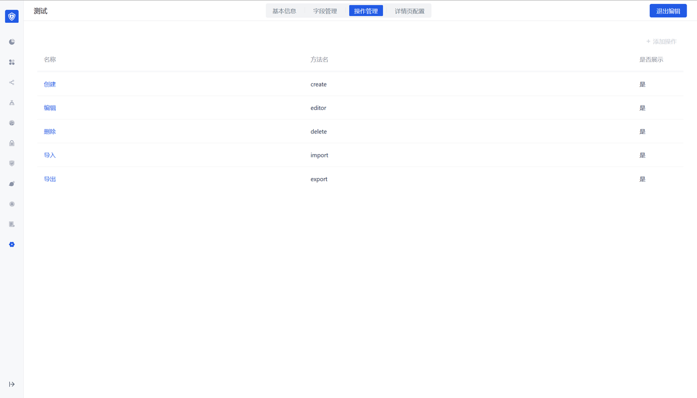
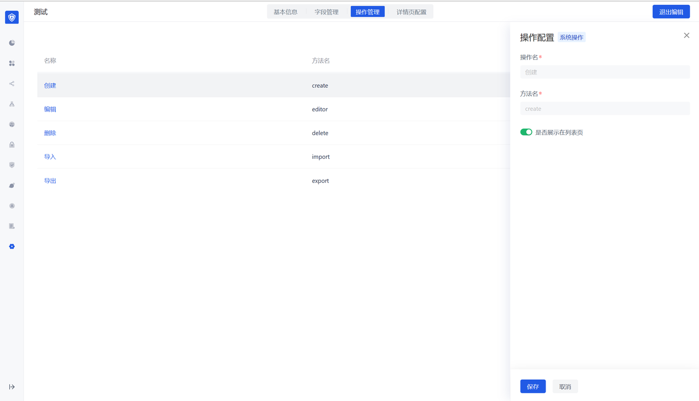
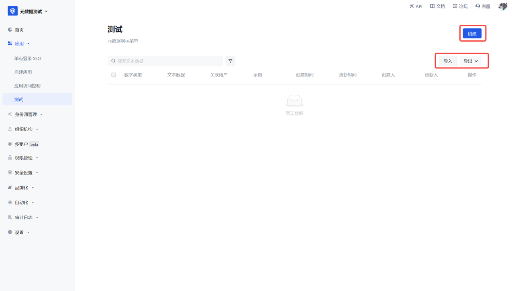

# Function 3: Operation Management

## Function Description

- Common operations are provided by default: create, edit, delete, import, export
- The corresponding functions can be turned off

## User Perspective

Corresponding operations of the list page

