# Function 2: Field Management

## Function Description

Supports common field types, including: text (single-line text, multi-line text), numbers, dates, selections (Boolean values, enumeration values), and associated data types.

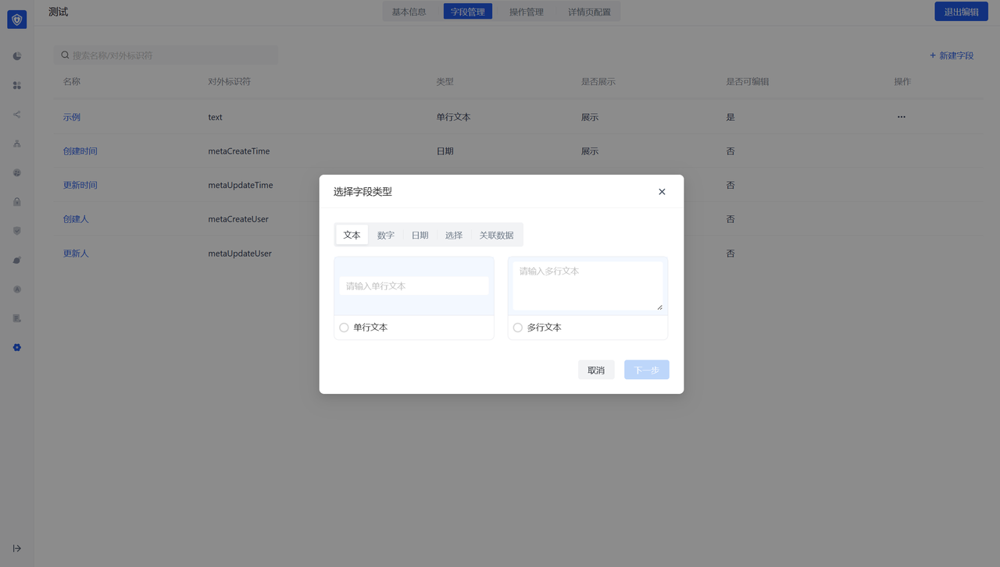

## Text Type

- Fields with help instructions filled in will have corresponding hover prompt icons when users create them, indicating instructions.
- Verification rules currently support: mobile phone number, email address, and custom verification method (regular expression).
- Text type can control the corresponding text length.

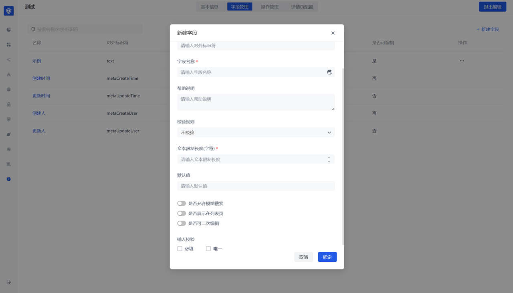

## Number Type

- Number type can configure the upper and lower limits of the number input by the user.
- Supports configuration of the number format displayed to the user, such as: retaining decimal places, thousandths, percentages, etc.

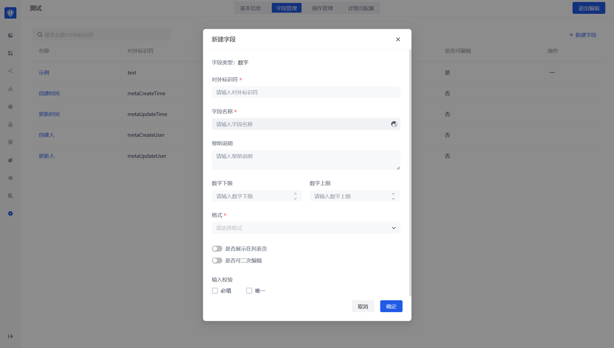

## Date type

- The number type can be configured to control the date range entered by the user.
- Supports configuration of the date format displayed to the user.

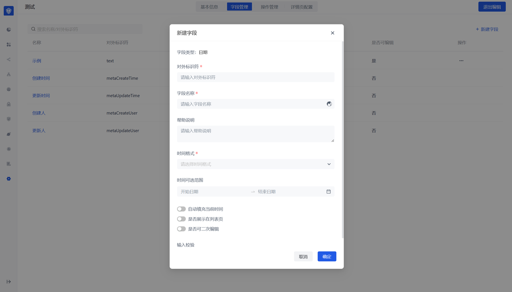

## Selection type

The selection type includes Boolean values ​​and enumeration values, where the enumeration value can be configured with the corresponding value and description.

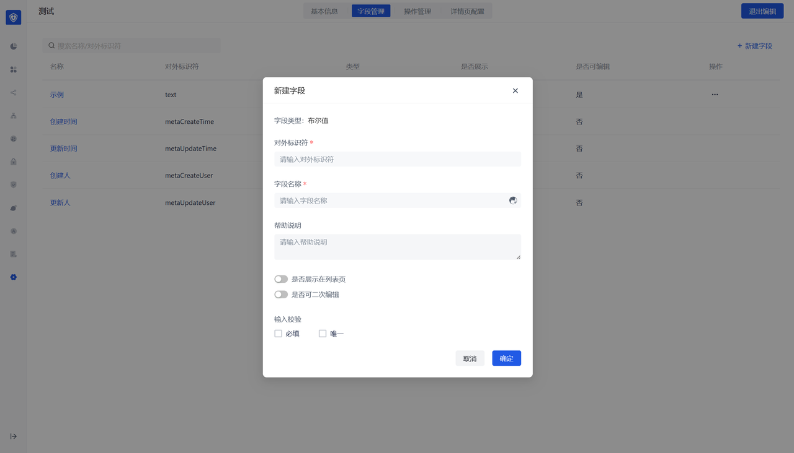

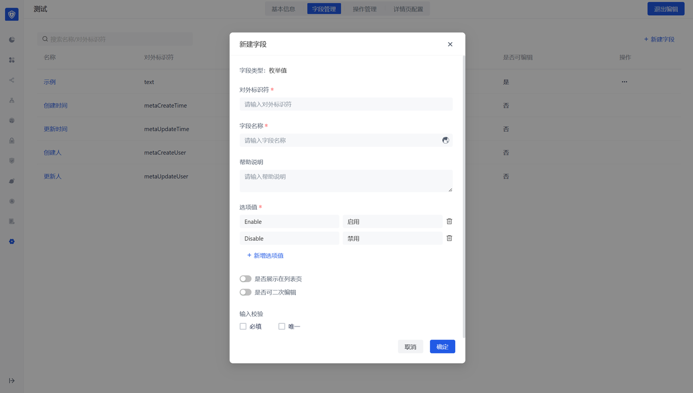

# Associated data

Associated data type: that is, you can create a field, and the field's <strong>drop-down value is taken from the data of other data objects</strong>.

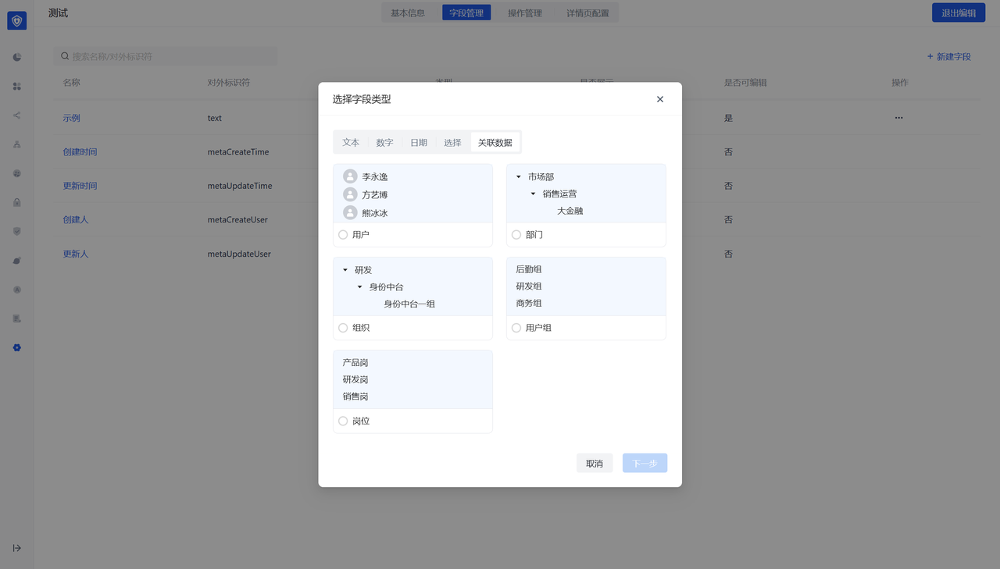

Display field when selecting data: control the corresponding drop-down value and which field of the associated object is displayed by default when displaying. <strong>It is recommended to configure the display of unique fields</strong> to facilitate the distinction of associated data.

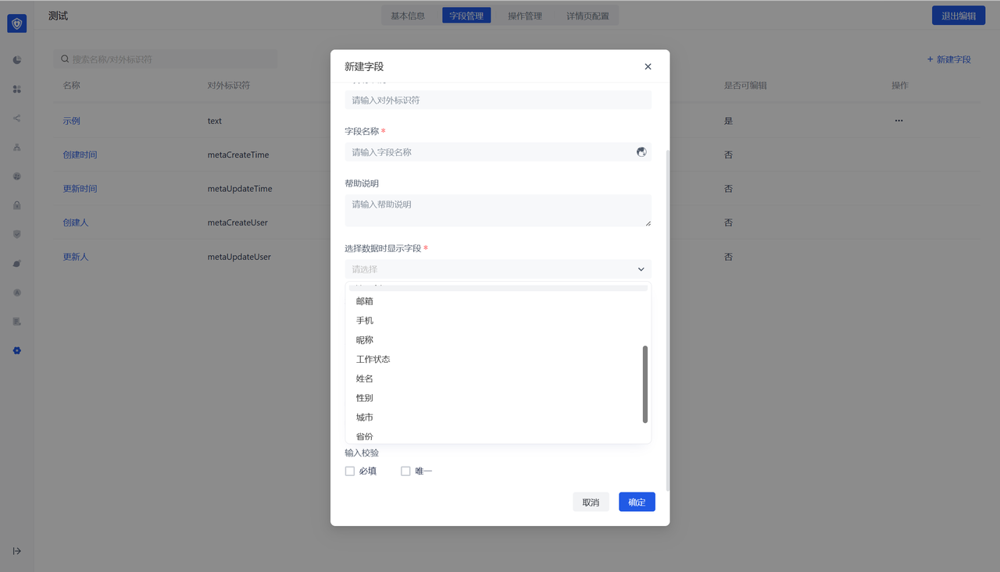

Optional range: You can control the drop-down value range of the associated data. If you do not select the default, you can select all data.

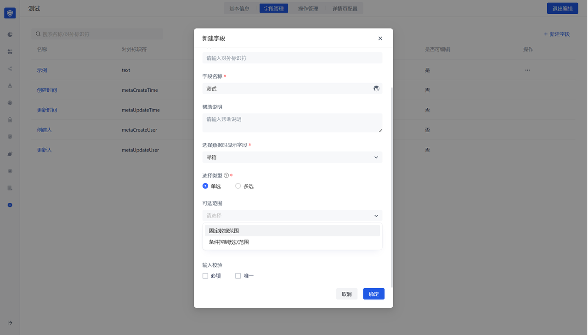

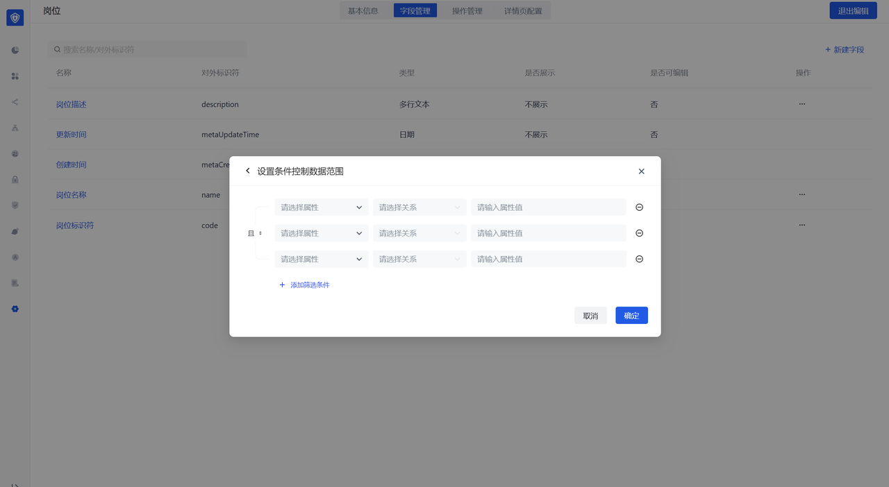

Special note: After configuring the associated data type, in addition to the data object being configured, an associated type field will also be generated on the associated data object side, but it is not displayed by default. If the associated fields on both sides are displayed, <string>bidirectional data association</string> can be achieved. That is: A is associated with B, and when A updates the association, B will update it synchronously; when B updates the association, A will also update it synchronously.

User perspective

- The list page shows the fields that the data object is configured to display on the list page
- Supports search and filtering

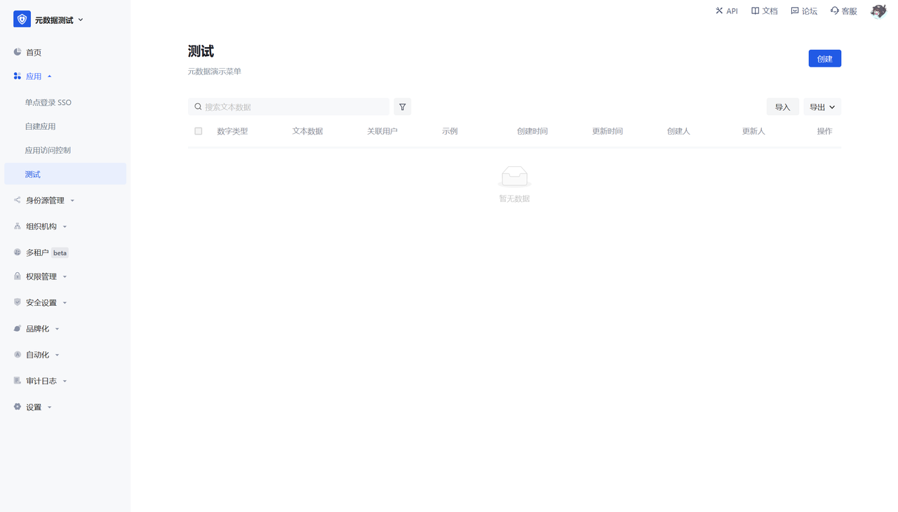

The creation page shows all the created fields of the data object

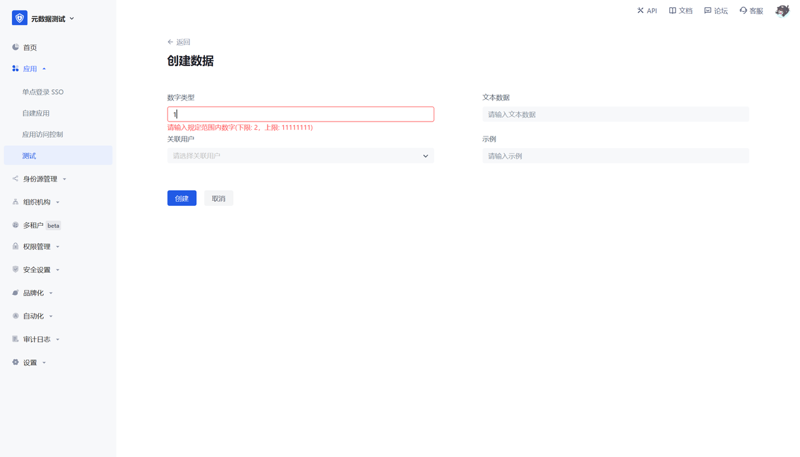
