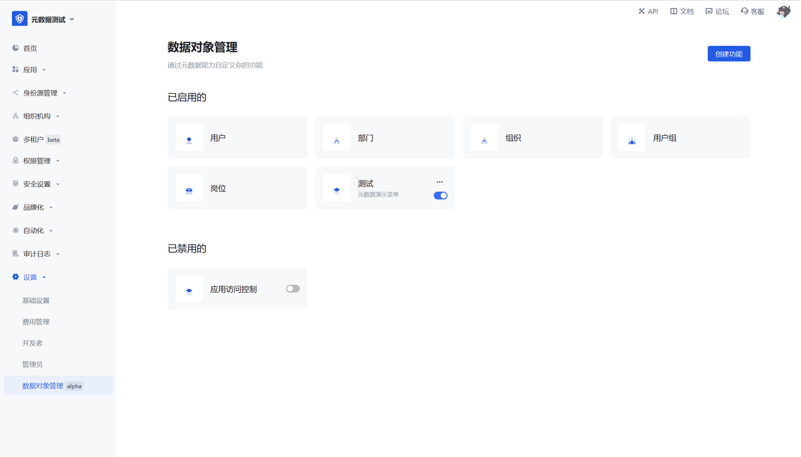

# Function 5: Domain Model

- Provides the best domain model for identity domain, including: users, departments, organizations, user groups, positions, and application access control
- Users can customize unique fields in the domain model

