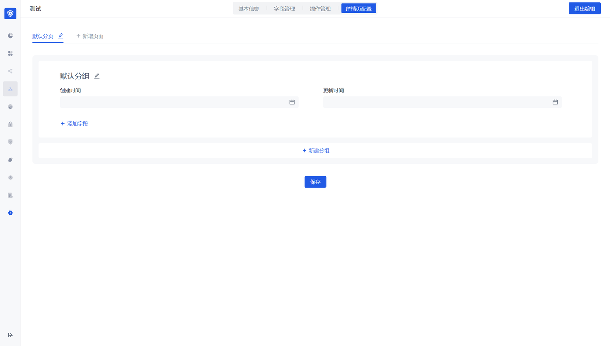
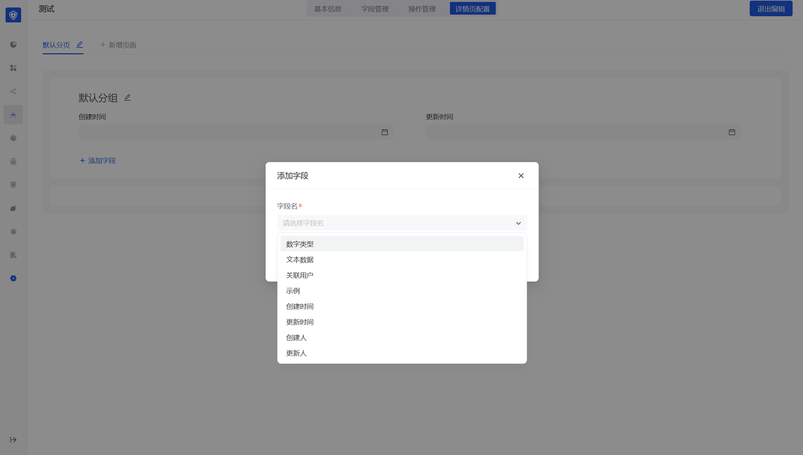
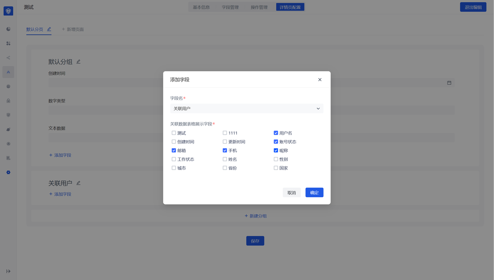
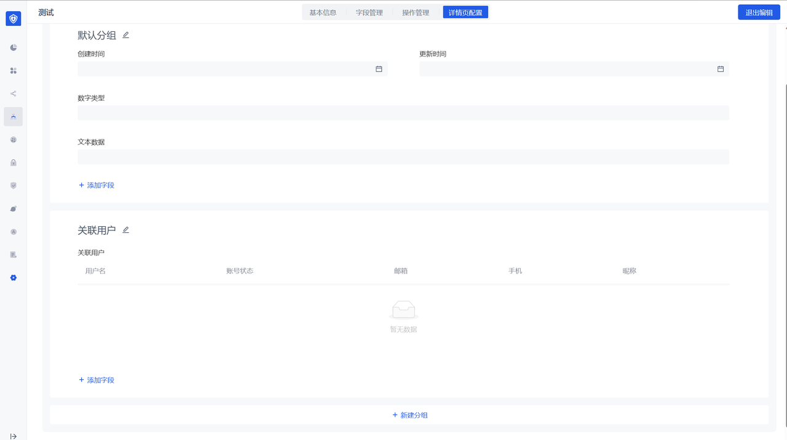

Function 4: Details page management

- You can configure the number of tab pages of the details page and the field information corresponding to each tab page
- You can drag and drop the created fields to configure the corresponding position and length of the placeholder

The associated data type field is quite special and finally presents a list structure

