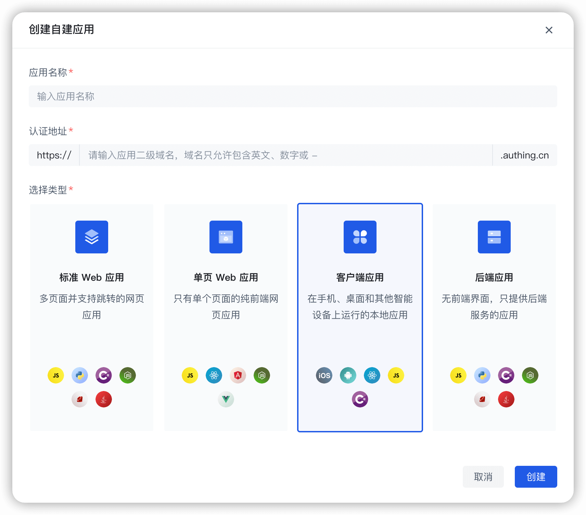

# SDK for Flutter

<LastUpdated/>

GenAuth Flutter SDK 为 Flutter 接入者提供了以下 GenAuth 认证能力：

- [登录](./apis/login.md)
- [注册](./apis/register.md)
- [用户资料](./apis/user.md)
- [MFA 要素管理](./apis/mfa.md)
- [用户相关资源](./apis/user-resources.md)
- [消息服务](./apis/message.md)
- [其他](./apis/utils.md)
- [OIDC 模块](./apis/oidc.md)

## 代码地址

| 条目     | 说明                                                                               |
| -------- | ---------------------------------------------------------------------------------- |
| 支持平台 | Android, iOS                                                                       |
| 仓库地址 | [https://pub.dev/packages/authing_sdk_v3](https://pub.dev/packages/authing_sdk_v3) |

## 开始之前

在开始开发之前，需要准备以下内容：

- 开发设备上安装 [AndroidStudio](https://developer.android.google.cn/studio) 以及 [Xcode](https://developer.apple.com/xcode/)
- 免费创建一个 [GenAuth 帐号](https://www.genauth.ai/)
- 在 GenAuth 控制台 [创建一个自建应用](https://docs.genauth.ai/guides/app-new/create-app/create-app.html)。

在 **选择类型** 时请选择：**客户端应用**。

<a href="./quick.html" style="color:#FFF;">快速开始 →</a>

 
