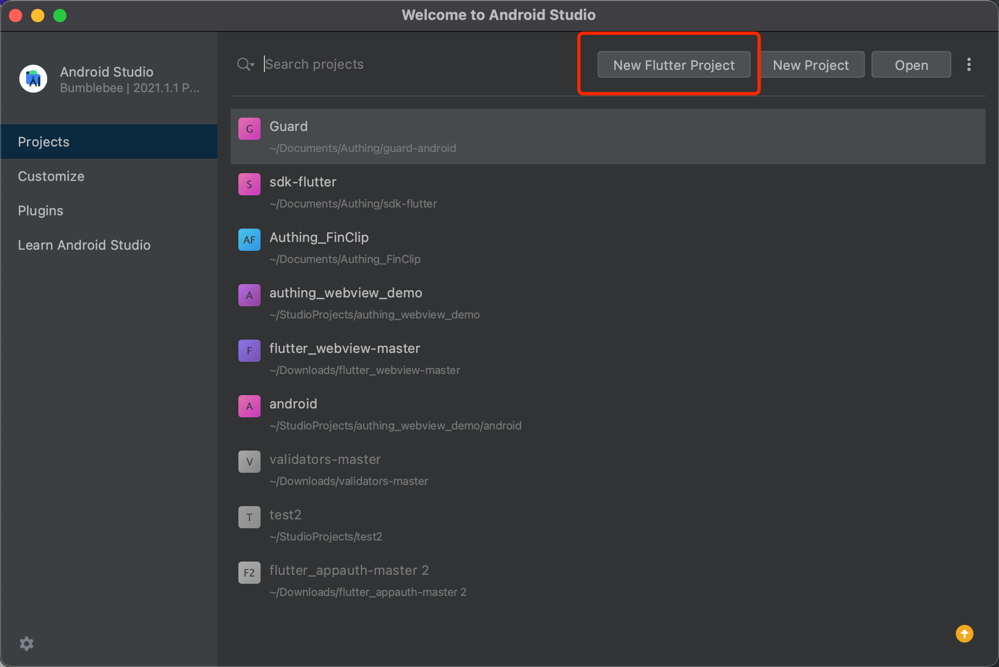
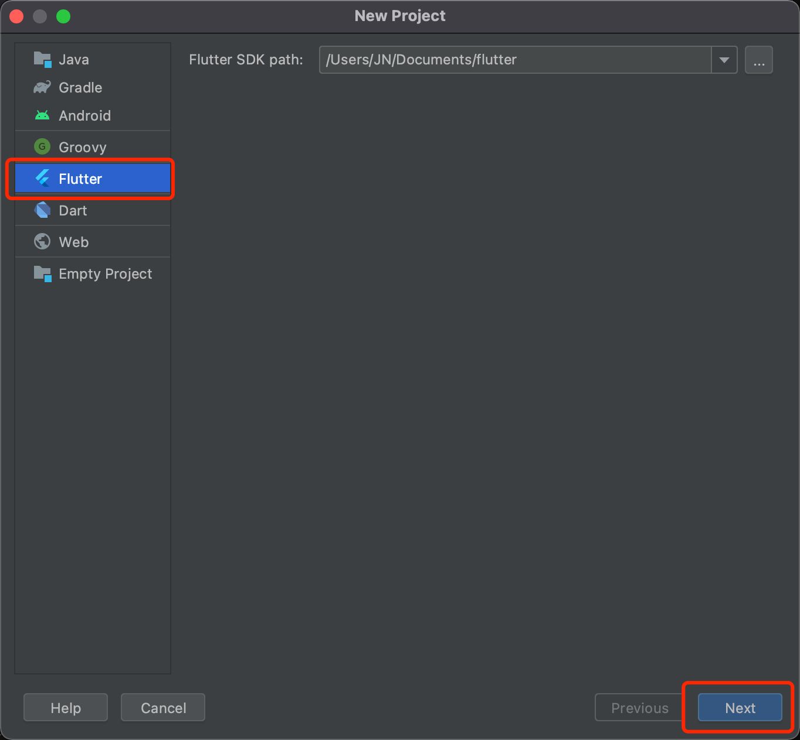
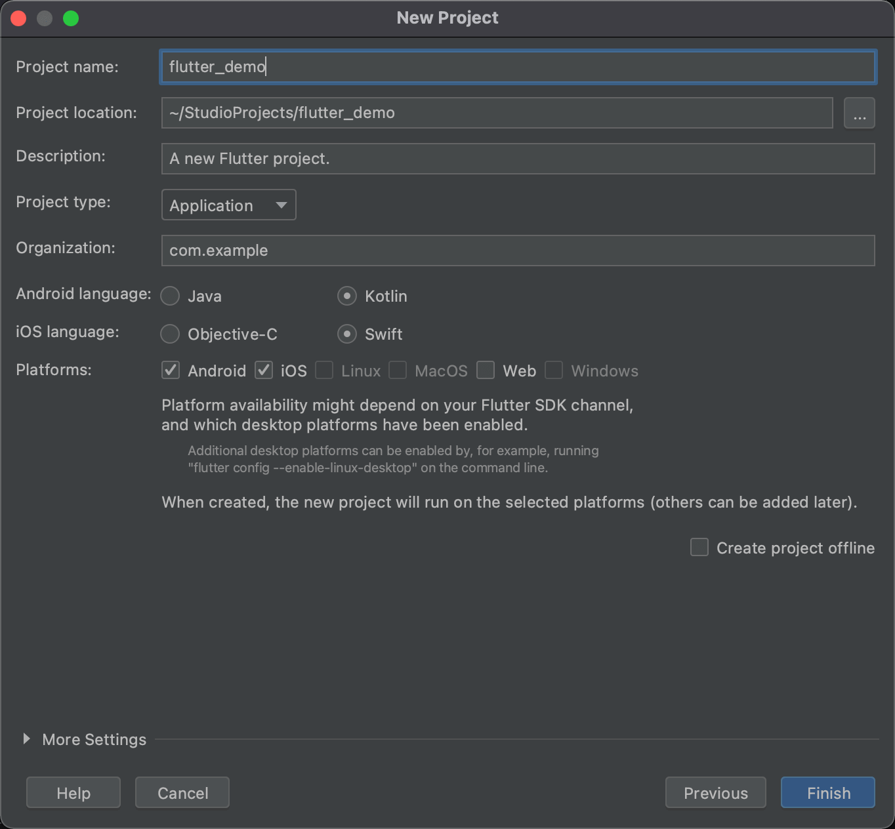

# 安装使用

<LastUpdated/>

## 第一步：新建 Flutter 工程







## 第二步：添加 SDK 依赖

在工程的 **pubspec.yaml** 中，添加以下依赖：

> 请替换 version 为真实版本号，最新的版本号请到 https://pub.dev/packages/authing_sdk_v3 进行查看。

```yaml
authing_sdk_v3: ^<version>
```

## 第三步：初始化 Flutter SDK

App 启动时，初始化 Flutter SDK：

```dart
import 'package:authing_sdk_v3/authing.dart';

GenAuth.init(String userPoolId, String appId)
```

**userPoolId** 为 GenAuth 控制台 [用户池 ID](https://docs.genauth.ai/guides/faqs/get-userpool-id-and-secret.html)。

**appId** 为 GenAuth 控制台 [App ID](https://docs.genauth.ai/guides/faqs/get-app-id-and-secret.html)。
