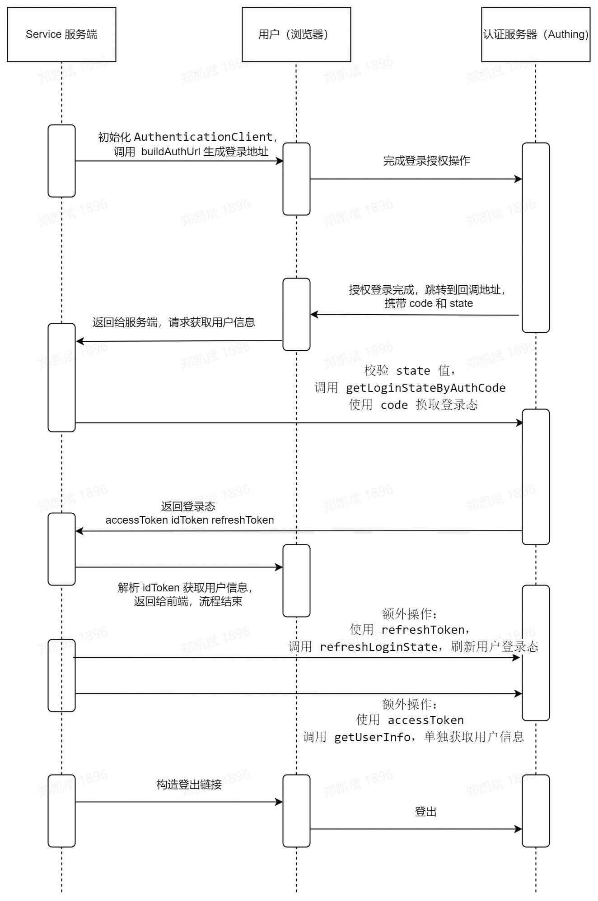

# Authentication module

<LastUpdated/>

The authentication module is implemented based on the OIDC standard protocol and supports methods such as obtaining authentication address, obtaining user login status, obtaining tokens, checking tokens, refreshing user login status, and logging out. This module only supports calls on the server side.

Note: Before using this module, you need to create a (GenAuth SDK)[/guides/app-new/create-app/create-app.md] and enable the self-built application SSO function. For specific documents, please refer to [Self-built application SSO solution](/guides/app-new/sso/create-app-sso.md).

Usage:
Use appId, appSecret, userPoolHost, redirectUri to initialize AuthenticationClient. After initialization, call buildAuthUrl to construct the front-end login link. After the user completes the login, call getLoginStateByAuthCode to verify the state value, and exchange the code for token (Access Token, ID Token, Refresh Token) to obtain the user login state. After the login is completed, call buildLogoutUrl to generate the logout URL. The user clicks to trigger the logout, completing the entire login and logout process.



Usage:

```javascript
// Initialize using AppId appSecret, userPoolHost, redirectUri
import { AuthenticationClient } from "@genauth/nodejs";

const authenticationClient = new AuthenticationClient({
  host: "userPoolHost",
  appId: "appId",
  appSecret: "appSecret",
  redirectUri: "redirectUri",
});
```

```javascript
authenticationClient.loginWithRedirect; // Redirect the user's browser to the authentication initiation URL of GenAuth for authentication
authenticationClient.buildAuthUrl; // Construct the front-end login link
authenticationClient.handleRedirectCallback; // Process the authentication return result at the application callback endpoint
authenticationClient.getLoginStateByAuthCode; // Get the user's login state with the authorization code
authenticationClient.getUserInfo; // Use Access Token Get user identity information
authenticationClient.refreshLoginState; // Refresh the user's login state with Refresh Token and extend the expiration time
authenticationClient.logoutWithRedirect; // Redirect the browser to the logout URL of GenAuth to log out
authenticationClient.buildLogoutUrl; // Generate logout URL
authenticationClient.parseAccessToken; // Verify and parse Access Token
authenticationClient.parseIDToken; // Verify and parse ID Token
```

### Initialization

Parameters when initializing AuthenticationClient:

- `appId` \<String\> GenAuth application ID;

- `appSecret` \<String\> GenAuth application Secret;

- `host` \<String\> User pool domain name, the user pool domain name where the GenAuth application is located, such as https://pool.genauth.ai;

- `redirectUri` \<String\> Redirection target URL after authentication is completed, which will be verified during authentication and needs to be the same as the login callback URL set by the application in the GenAuth console Keep it consistent.
- `logoutRedirectUri` \<String\> The redirection target URL after logout is completed.
- `scope` \<String\> The resource permissions that the token has (the permissions requested by the application side to GenAuth), separated by spaces, the default is 'openid profile', and the successfully obtained permissions will appear in the scope field of the Access Token. For more scope definitions, see the GenAuth related [documentation](https://docs.genauth.ai/concepts/oidc-common-questions.html#scope-%E5%8F%82%E6%95%B0%E5%AF%B9%E5%BA%94%E7%9A%84%E7%94%A8%E6%88%B7%E4%BF%A1%E6%81%AF).
- `serverJWKS` \<String\> The JWKS public key of the server, used to verify the Token signature. By default, it will be automatically obtained from the JWKS endpoint of the server through a network request.
- `cookieKey` \<String\> The name of the cookie that stores the authentication context, used to store the user's authentication status on the methods loginWithRedirect and handleRedirectCallback.

#### Example

```javascript
// Initialize using AppId, AppSecret, AppHost, redirectUri
const authenticationClient = new AuthenticationClient({
  host: "APP_HOST",
  appId: "APP_ID",
  appSecret: "APP_SECRET",
  redirectUri: "redirectUri",
});
```

### Redirect the user's browser to the authentication initiation URL of GenAuth for authentication

```js
authenticationClient.loginWithRedirect(res, options);
```

> When a user initiates an authentication request, you can call this method directly on the server side, and redirect the user's browser to the authentication initiation URL of GenAuth for authentication by operating the response object of the request.

#### Parameters

- `res` \<ServerResponse\> The response object of the operation request, directly redirecting the user's browser to the authentication initiation URL of GenAuth.

- `options` \<options\> The parameters that need to be filled in when initiating authorized login.
- `options.scope` \<String\> The resource permissions that the token has (the permissions requested by the application side GenAuth), overwriting the corresponding settings in the initialization parameters.
- `options.nonce` \<String\> Random string, optional, automatically generated by default.
- `options.state` \<String\> Random string, optional, automatically generated by default.
- `options.redirectUri` \<String\> Callback address, overwriting the corresponding settings in the initialization parameters.
- `options.forced` \<Boolean\> Force the login page to be displayed even if the user is already logged in.

### Generate user login link

```js
authenticationClient.buildAuthUrl(options);
```

> Call this method to generate a user login link and return it to the front end, triggering the login authentication process at the right time. Note: the generated state and nonce parameters need to be cached and verified after the authentication is completed. After the user authentication is successful, the authentication address jumps to the callback address, and the code and state values ​​are carried in the URL parameters; if the authentication fails, the error field will be carried in the URL parameters and the error message will be returned.

#### Parameters

- `options` \<options\> Parameters to be filled in when initiating authorized login.

- `options.scope` \<String\> Resource permissions that the token has (application-side GenAuth request permissions), overwriting the corresponding settings in the initialization parameters.

- `options.nonce` \<String\> Random string, optional, automatically generated by default.

- `options.state` \<String\> Random string, optional, automatically generated by default.
- `options.redirectUri` \<String\> callback address, overwriting the corresponding setting in the initialization parameters.
- `options.forced` \<Boolean\> Force the login page to be displayed even if the user is already logged in.

#### Example

```javascript
// Generate the authentication address, the user logs in through the authentication address, and jumps to the specified redirectUri with code and state
const authUrl = authenticationClient.buildAuthUrl({
  scope: "openid profile",
  state: "random string",
  nonce: "random string",
  redirectUri: "https://www.genauth.ai",
  forced: false,
});
```

#### Example data

```js
{
url: 'https://<user pool domain name>.genauth.ai/oidc/auth?redirect_uri=https%3A%2F%2Fbaidu.com&response_mode=query&response_type=code&client_id=625fa4682e45fc2546331f25&scope=openid%20profile&state=AHyb4cXlwYbYtuFP&nonce=0BChaRhqezrMup1D',
state: "random string",
nonce: "random string"
}
```

### Apply callback endpoint to process authentication return result

```js
authenticationClient.handleRedirectCallback(req, res);
```

> After the user completes the authentication, jump to the callback address, verify the state value by calling this method, and consume the code to obtain the corresponding login information.

#### Parameters

- `req` \<IncomingMessage\> IncomingMessage object is created by Server or ClientRequest and passed as the first parameter to "request" and "response" events respectively. It can be used to access response status, headers and data, here we use it to get the request object, which is used to get the authentication result and context cookies.

- `res` \<ServerResponse\> response object, which is used to clear the context cookies.

#### Example

```javascript
const result = authenticationClient.handleRedirectCallback(req, res);
```

#### Example data

````json
{
"accessToken": "eyJhbGciOiJSUzI1NiIsInR5cCI6IkpXVCIsImtpZCI6InVlTVFVSDI1Ny1DWXQzOUFoblZNVXY2TUZrVjd1Q2xTWVU3T0VMZ1lzNzAifQ.eyJqdGkiO iJpbFFCczNmSVRpSlR5UHpQWDdYdFIiLCJzdWIiOiI2MmEyZmU2NTg4NTMzNTM0N2IwY2IwOWUiLCJpYXQiOjE2NTUyMDgyMDEsImV4cCI6MTY1NjQxNzgwMSwic2NvcGUiOiJvcGVuaWQgcHJvZmlsZSIsImlzcyI6Imh0dHBzOi8vdGVzdC5teXNxbC5hdXRoaW5nLWluYy5jby9vaWRjIiwiYXVkIjoiNjI1ZmE0Njgy ZTQ1ZmMyNTQ2MzMxZjI1In0.G0yT6ipreRco4LNmJmSoV3753MMmrnNaLe4Vikw4zEPDLHwAEtsxO2C92R3natBTo6SUrGES8l_rknjAnVC0GjxDWhmt28TrXe0 OEnafcsFLWbT2Q_qXJS3QcW_eeDpqIgibGY8fmHNydQ3WqC69mOvhW20YXmKLdhxBpgxzn9g95tbEadV9_y1e-5n_HCjBd6BRJn2-X_uIGgkKwNQFrzOhQ5GlF ZH7ejoajvIQcx8gZhJDU-3dUi2g_xWwBkvvTSwXvXzP_rFvpaXxlHj75amgS0YPNm61lawChNzWhuJtucY4XNmFiTOwb1DTKsZNGsRUiFnzfxZffpgPZT89lA", "idToken": "eyJhbGciOiJIUzI1NiIsInR5cCI6IkpXVCJ9.eyJzdWIiOiI2MmEyZmU2NTg4NTMzNTM0N2IwY2IwOWUiLCJiaXJ0aGRhdGUiOm51bGwsImZhbWls eV9uYW1lIjpudWxsLCJnZW5kZXIiOiJVIiwiZ2l2ZW5fbmFtZSI6bnVsbCwibG9jYWxlIjpudWxsLCJtaWRkbGVfbmFtZSI6bnVsbCwibmFtZSI6bnV sbCwibmlja25hbWUiOm51bGwsInBpY3R1cmUiOiJodHRwczovL3MzLWltZmlsZS5mZWlzaHVjZG4uY29tL3N0YXRpYy1yZXNvdXJjZS92MS92Ml83N jAxMjk3MC01YjgxLTQ3YWUtODRlNy0wYjFkNGVkMjAwYWd-P2ltYWdlX3NpemU9NzJ4NzImY3V0X3R5cGU9JnF1YWxpdHk9JmZvcm1hdD1pbWFnZSZz dGlja2VyX2Zvcm1hdD0ud2VicCIsInByZWZlcnJlZF91c2VybmFtZSI6bnVsbCwicHJvZmlsZSI6bnVsbCwidXBkYXRlZF9hdCI6IjIwMjItMDYtMT RUMTE6MzE6MDYuNzA3WiIsIndlYnNpdGUiOm51bGwsInpvbmVpbmZvIjpudWxsLCJub25jZSI6IlJ3UVNZWENVdE5ZZTl0NEsiLCJhdF9oYXNoIjoiW jhiOEJNOUYtQTJLMVc3dHVLT1ZxdyIsImF1ZCI6IjYyNWZhNDY4MmU0NWZjMjU0NjMzMWYyNSIsImV4cCI6MTY1NjQxNzgwMSwiaWF0IjoxNjU1MjA 4MjAxLCJpc3MiOiJodHRwczovL3Rlc3QubXlzcWwuYXV0aGluZy1pbmMuY28vb2lkYyJ9.psojXChTqdr2S_TeFm1Tq9qoV-AZHVFj3X0pIGqcuwM",
"refreshToken": undefined, "expireAt": 1209600, "parsedIDToken": { "sub": "62a2fe65885335347b0cb09e", "birthdate": null, "family_name": null, "gender": "U", "given_name": null, "locale": null, "middle_name": null, "name": null, "nickname": null, "picture": "https://s3-imfile.feishucdn.com/static-resource/v1/v2_76012970-5b81-47ae-84e7-0b1d4ed200ag~?image_size=72x72&cut_type=&quality=&format=image&sticker_format=.webp", "preferred_username": null, "profile": null, "updated_at": "2022-06-14T11:31:06.707Z", "website": null, "zoneinfo": null, "nonce": "RwQSYXCUtNYe9t4K", "at_hash": "Z8b8BM9F-A2K1W7tuKOVqw", "aud": "625fa4682e45fc2546331f2", "exp": 1656417801, "iat": 1655208201, "iss": "https://test.authing.co/oidc" }, "parsedAccessToken": { "jti": "ilQBs3fITiJTyPzPX7XtR", "sub": "62a2fe65885335347b0cb09e", "iat": 1655208201,
"exp": 1656417801,
"scope": "openid profile",
"iss": "https://test.authing.co/oidc",
"aud": "625fa4682e45fc2546331f25"
}
}
`` `

Field explanation:

| Field name| Meaning|
| ----------------- | --------------------- -------------------------------------------------- --- |
| accessToken | Access Token, Access Token issued by GenAuth |
| idToken | ID token, user identity certificate issued by GenAuth. By decrypting, some user information can be obtained |
| refreshToken | Used to refresh the user's login status , extend the expiration time|
| expireAt | expiration time|
| parsedIDToken | The result of parsing the ID token, the specific fields are explained below|
| parsedAccessToken | The result of parsing the Access Token, the specific fields are explained below |

### Get the user login status with the authorization code```js
authenticationClient.getLoginStateByAuthCode(code, redirectUri);
````

> After the user logs in, use the obtained authorization code to get the user's login status information. If the scope is initialized The field contains profile. The login process ends here. The user information is included in the parsed ID Token. The login status information includes ID Token, Access Token, Refresh Token, Access Token expiration time, and the parsed ID Token contains The (user) information of the Access Token is parsed. Note: 1. Before calling, the state value after authentication needs to be compared and verified. 2. After obtaining the user login state information, it needs to be compared and parsed. Whether the nonce value in the ID Token is consistent with the local cache.

#### Parameter - `code` \<String\> Authorization code Code. After the user successfully authenticates, GenAuth will send the authorization code Code to the callback address , each Code can only be used once.

- `redirectUri` \<String\> The callback address passed in when initiating authentication.

#### Example```javascript

const res = await authenticationClient.getLoginStateByAuthCode(
code,
redirectUri
);

````

#### Example data` ``json
{
"accessToken": "eyJhbGciOiJSUzI1NiIsInR5cCI6IkpXVCIsImtpZCI6InVlTVFVSDI1Ny1DWXQzOUFoblZNVXY2TUZrVjd1Q2xTWVU3T0VMZ1lzNzAifQ.eyJqdGkiOiJpbFFCczNmSVRpSlR5UHpQWDdYdFIiLCJzdWIiOiI2MmEyZmU2NTg4NTMzNTM0N 2IwY2IwOWUiLCJpYXQiOjE2NTUyMDgyMDEsImV4cCI6MTY1NjQxNzgwMSwic2NvcGUiOiJvcGVuaWQgcHJvZmlsZSI sImlzcyI6Imh0dHBzOi8vdGVzdC5teXNxbC5hdXRoaW5nLWluYy5jby9vaWRjIiwiYXVkIjoiNjI1ZmE0NjgyZTQ1Zm MyNTQ2MzMxZjI1In0.G0yT6ipreRco4LNmJmSoV3753MMmrnNaLe4Vikw4zEPDLHwAEtsxO2C92R3natBTo6SUrGES 8l_rknjAnVC0GjxDWhmt28TrXe0OEnafcsFLWbT2Q_qXJS3QcW_eeDpqIgibGY8fmHNydQ3WqC69mOvhW20YXmKLdhx Bpgxzn9g95tbEadV9_y1e-5n_HCjBd6BRJn2-X_uIGgkKwNQFrzOhQ5GlFZH7ejoajvIQcx8gZhJDU-3dUi2g_xWwB kvvTSwXvXzP_rFvpaXxlHj75amgS0YPNm61lawChNzWhuJtucY4XNmFiTOwb1DTKsZNGsRUiFnzfxZffpgPZT89lA", "idToken": "eyJhbGciOiJIUzI1NiIsInR5cCI6IkpXVCJ9.eyJzdWIiOiI2MmEyZmU2NTg4NTMzNTM0N2IwY2IwOWUiLCJiaXJ 0aGRhdGUiOm51bGwsImZhbWlseV9uYW1lIjpudWxsLCJnZW5kZXIiOiJVIiwiZ2l2ZW5fbmFtZSI6bnVsbCwibG9jY WxlIjpudWxsLCJtaWRkbGVfbmFtZSI6bnVsbCwibmFtZSI6bnVsbCwibmlja25hbWUiOm51bGwsInBpY3R1cmUiOi JodHRwczovL3MzLWltZmlsZS5mZWlzaHVjZG4uY29tL3N0YXRpYy1yZXNvdXJjZS92MS92Ml83NjAxMjk3MC01YjgxLTQ3YWUtODRlNy0wYjFkNGVkMjAwYWd-P2ltYWdlX3NpemU9NzJ4NzImY3V0X3R5cGU9J nF1YWxpdHk9JmZvcm1hdD1pbWFnZSZzdGlja2VyX2Zvcm1hdD0ud2VicCIsInByZWZlcnJ lZF91c2VybmFtZSI6bnVsbCwicHJvZmlsZSI6bnVsbCwidXBkYXRlZF9hdCI6IjIwMjItM DYtMTRUMTE6MzE6MDYuNzA3WiIsIndlYnNpdGUiOm51bGwsInpvbmVpbmZvIjpudWxsLCJ ub25jZSI6IlJ3UVNZWENVdE5ZZTl0NEsiLCJhdF9oYXNoIjoiWjhiOEJNOUYtQTJLMVc3dHVLT1ZxdyIsImF1ZCI6IjYyNWZhNDY4MmU0NWZjMjU0NjMzMWYyNSIsImV4cCI6MTY1Nj QxNzgwMSwiaWF0IjoxNjU1MjA4MjAxLCJpc3MiOiJodHRwczovL3Rlc3QubXlzcWwuYXV0aGluZy1pbmMuY28vb2lkYyJ9.psojXChTqdr2S_TeFm1Tq9qoV-AZHVFj3X0pIGqcuwM",
"refreshToken": undefined, "expireAt": 1209600, "parsedIDToken": { "sub": "62a2fe65885335347b0cb09e", "birthdate": null, "family_name": null, "gender": "U", "given_name": null, "locale": null, "middle_name": null, "name": null, "nickname": null, "picture": "https://s3-imfile.feishucdn.com/static-resource/v1/v2_76012970-5b81-47ae-84e7-0b1d4ed200ag~?image_size=72x72&cut_type=&quality=&format=image&sticker_format=.webp", "preferred_username": null, "profile": null, "updated_at": "2022-06-14T11:31:06.707Z", "website": null, "zoneinfo": null, "nonce": "RwQSYXCUtNYe9t4K", "at_hash": "Z8b8BM9F-A2K1W7tuKOVqw", "aud": "625fa4682e45fc2546331f2", "exp": 1656417801, "iat": 1655208201, "iss": "https://test.authing.co/oidc" }, "parsedAccessToken": { "jti": "ilQBs3fITiJTyPzPX7XtR", "sub": "62a2fe65885335347b0cb09e", "iat": 1655208201,
"exp": 1656417801,
"scope": "openid profile",
"iss": "https://test.authing.co/oidc",
"aud": "625fa4682e45fc2546331f25"
}
}
`` `

### Token exchange for user information```js
authenticationClient.getUserInfo(accessToken);
````

> After calling getLoginStateByAuthCode, you can get the Access Token, and use the Access Token to get user information through getUserInfo.

#### Parameter - `access_token` \<String\> Access Token, the content of the Access Token obtained by using the authorization code Code. For details, see [Using OIDC Authorization Code Mode](/federation/oidc/authorization-code/).

#### Example `javascript const res = await authenticationClient.getUserInfo("Access Token"); ` #### Sample data ```json { "sub": "62a2fe65885335347b0cb09e", "birthdate": null, "family_name": null, "gender": "U", "given_name": null, "locale": null, "middle_name": null, "name": null, "nickname": null, "picture": "https://s3-imfile.feishucdn.com/static-resource/v1/v2_76012970-5b81-47ae-84e7-0b1d4ed200ag~?image_size=72x72&cut_type=&quality=&format=image&sticker_format=.webp",

"preferred_username": null, "profile": null,
"updated_at": "2022-06-14T11:31:06.707Z",
"website": null,
"zoneinfo": null
}

````

Field explanation:

| Field name| Translation|
| :- ---------------- | :-------------------------------- ------ |
| sub | Abbreviation of subject, unique identifier, usually user ID |
| name | given name |
| given_name | given name |
| family_name | surname |
| middle_name | middle name|
| nickname | nickname|
| preferred_username | preferred name|
| profile | basic information|
| picture | avatar|
| website | website link|
| gender | gender|
| birthdate | birthday|
| zoneinfo | time zone|
| locale | region|
| updated_at | information update time|

### Refresh login state```js
authenticationClient.refreshLoginState(refreshToken);
````

> Use Refresh Token to refresh login state and extend the validity period of Access Token.

#### Parameter - `refreshToken` \<String\> Refresh Token. To obtain the Refresh Token, you need to add offline_access to the scope parameter, and then you can get the refreshToken from the return value of the authenticationClient.getLoginStateByAuthCode method.

#### Example `javascript const res = authenticationClient.refreshLoginState(refreshToken); ` #### Sample data ```json { "accessToken": "eyJhbGciOiJSUzI1NiIsInR5cCI6IkpXVCIsImtpZCI6InVlTVFVSDI1Ny1DWXQzOUFoblZNVXY2TUZrVjd1Q2xTW VU3T0VMZ1lzNzAifQ.eyJqdGkiOiJpbFFCczNmSVRpSlR5UHpQWDdYdFIiLCJzdWIiOiI2MmEyZmU2NTg4NTMzNTM0N 2IwY2IwOWUiLCJpYXQiOjE2NTUyMDgyMDEsImV4cCI6MTY1NjQxNzgwMSwic2NvcGUiOiJvcGVuaWQgcHJvZmlsZSI sImlzcyI6Imh0dHBzOi8vdGVzdC5teXNxbC5hdXRoaW5nLWluYy5jby9vaWRjIiwiYXVkIjoiNjI1ZmE0NjgyZTQ1Zm MyNTQ2MzMxZjI1In0.G0yT6ipreRco4LNmJmSoV3753MMmrnNaLe4Vikw4zEPDLHwAEtsxO2C92R3natBTo6SUrGES 8l_rknjAnVC0GjxDWhmt28TrXe0OEnafcsFLWbT2Q_qXJS3QcW_eeDpqIgibGY8fmHNydQ3WqC69mOvhW20YXmKLdhx Bpgxzn9g95tbEadV9_y1e-5n_HCjBd6BRJn2-X_uIGgkKwNQFrzOhQ5GlFZH7ejoajvIQcx8gZhJDU-3dUi2g_xWwB kvvTSwXvXzP_rFvpaXxlHj75amgS0YPNm61lawChNzWhuJtucY4XNmFiTOwb1DTKsZNGsRUiFnzfxZffpgPZT89lA",

"idToken": "eyJhbGciOiJIUzI1NiIsInR5cCI6IkpXVCJ9.eyJzdWIiOiI2MmEyZmU2NTg4NTMzNTM0N2IwY2IwOWUiLCJiaXJ0aGRhdGU iOm51bGwsImZhbWlseV9uYW1lIjpudWxsLCJnZW5kZXIiOiJVIiwiZ2l2ZW5fbmFtZSI6bnVsbCwibG9jYWxlIjpudWxsLCJtaWRkbGVfbmFtZSI6bnVsbCwibmFtZSI6bnVsbCwibmlja25hbWUiOm51bGwsInBpY3R1cmUiOiJodHRwczovL3MzLW ltZmlsZS5mZWlzaHVjZG4uY29tL3N0YXRpYy1yZXNvdXJjZS92MS92Ml83NjAxMjk3MC01YjgxLTQ3YWUtODRlNy0w YjFkNGVkMjAwYWd-P2ltYWdlX3NpemU9NzJ4NzImY3V0X3R5cGU9JnF1YWxpdHk9JmZvcm1hdD1pbWFnZSZzdGlja2 VyX2Zvcm1hdD0ud2VicCIsInByZWZlcnJlZF91c2VybmFtZSI6bnVsbCwicHJvZmlsZSI6bnVsbCwidXBkYXRlZF9hd CI6IjIwMjItMDYtMTRUMTE6MzE6MDYuNzA3WiIsIndlYnNpdGUiOm51bGwsInpvbmVpbmZvIjpudWxsLCJub25jZSI 6IlJ3UVNZWENVdE5ZZTl0NEsiLCJhdF9oYXNoIjoiWjhiOEJNOUYtQTJLMVc3dHVLT1ZxdyIsImF1ZCI6IjYyNWZhND Y4MmU0NWZjMjU0NjMzMWYyNSIsImV4cCI6MTY1NjQxNzgwMSwiaWF0IjoxNjU1MjA4MjAxLCJpc3MiOiJodHRwczov L3Rlc3QubXlzcWwuYXV0aGluZy1pbmMuY28vb2lkYyJ9.psojXChTqdr2S_TeFm1Tq9qoV-AZHVFj3X0pIGqcuwM",
"refreshToken": undefined, "expireAt": 1209600, "parsedIDToken": { "sub": "62a2fe65885335347b0cb09e", "birthdate": null, "family_name": null, "gender": "U", "given_name": null, "locale": null, "middle_name": null, "name": null, "nickname": null, "picture": "https://s3-imfile.feishucdn.com/static-resource/v1/v2_76012970-5b81-47ae-84e7-0b1d4ed200ag~?image_size=72x72&cut_type=&quality=&format=image&sticker_format=.webp", "preferred_username": null, "profile": null, "updated_at": "2022-06-14T11:31:06.707Z", "website": null, "zoneinfo": null, "nonce": "RwQSYXCUtNYe9t4K", "at_hash": "Z8b8BM9F-A2K1W7tuKOVqw", "aud": "625fa4682e45fc2546331f2", "exp": 1656417801, "iat": 1655208201, "iss": "https://test.authing.co/oidc" }, "parsedAccessToken": { "jti": "ilQBs3fITiJTyPzPX7XtR", "sub": "62a2fe65885335347b0cb09e", "iat": 1655208201,
"exp": 1656417801,
"scope": "openid profile",
"iss": "https://test.authing.co/oidc",
"aud": "625fa4682e45fc2546331f25"
}
}
`` `

### Redirect the browser to the GenAuth logout URL to log out```js

authenticationClient.logoutWithRedirect(res, options);

````

> Redirect the browser to the GenAuth logout URL to log out. #### Parameters - `res` \<ServerResponse\> Directly redirect the user's browser to the GenAuth authentication initiation URL by operating the response object.
- `options` \<options\> Need to be filled in when initiating authorized login Parameters.
- `options.idToken` \<String\> The ID Token obtained when the user logs in, used to invalidate the user token, it is recommended to pass it in.
- `options.state` \<String\> The intermediate state identifier passed to the target URL .
- `options.redirectUri` \<String\> The redirection target URL after logout is completed, overwriting the corresponding setting in the initialization parameters.

#### Example ```javascript
const res = authenticationClient.logoutWithRedirect(res, {
idToken : "",
redirectUri: "https://www.genauth.ai",
state: "Randomly generated intermediate identifier",
});
````

### Generate logout URL

authenticationClient.buildLogoutUrl(options)

> Generate login Logout URL.

#### Parameters - `options` \<options\> Parameters to be filled in when initiating a logout request.

- `options.idToken` \<String\> The ID Token obtained when the user logs in, used to invalidate the user token, it is recommended to pass it in.
- `options.state` \<String\> The intermediate state identifier passed to the target URL .
- `options.redirectUri` \<String\> The redirection target URL after logout is completed, overwriting the corresponding setting in the initialization parameters. Note: For security reasons 1. This parameter must be called together with idToken, otherwise redirection cannot be achieved 2. The redirect address must be set in advance in the GenAuth console, in the details of the self-built application, in the Application Configuration page, Logout callback URL. Redirect to the redirect address.

#### Example ```javascript

const res = authenticationClient.buildLogoutUrl({
idToken: "",
redirectUri: "https://www.genauth.ai",
state: "Randomly generated Middle mark",
});

````

#### Sample data

```json
genauth.ai/oidc/session/end?/oidc/session/end?post_logout_redirect_uri=https%3A%2F%2Fbaidu.com&state=state&id_token_hint=eyJhbGciOiJSUzI1NiIsInR5cCI6IkpXVCIsImtpZCI6InVlTVFVSDI1Ny1DWXQzOUFoblZNVXY2TUZrV jd1Q2xTWVU3T0VMZ1lzNzAifQ.eyJqdGkiOiJpbFFCczNmSVRpSlR5UHpQWDdYdFIiLCJzdWIiOiI2MmEyZmU2NTg4NTMzNTM0N2IwY2IwOW UiLCJpYXQiOjE2NTUyMDgyMDEsImV4cCI6MTY1NjQxNzgwMSwic2NvcGUiOiJvcGVuaWQgcHJvZmlsZSIsImlzcyI6Imh0dHBzOi8vdGVzdC 5teXNxbC5hdXRoaW5nLWluYy5jby9vaWRjIiwiYXVkIjoiNjI1ZmE0NjgyZTQ1ZmMyNTQ2MzMxZjI1In0.G0yT6ipreRco4LNmJmSoV3753M MmrnNaLe4Vikw4zEPDLHwAEtsxO2C92R3natBTo6SUrGES8l_rknjAnVC0GjxDWhmt28TrXe0OEnafcsFLWbT2Q_qXJS3QcW_eeDpqIgibGY 8fmHNydQ3WqC69mOvhW20YXmKLdhxBpgxzn9g95tbEadV9_y1e-5n_HCjBd6BRJn2-X_uIGgkKwNQFrzOhQ5GlFZH7ejoajvIQcx8gZhJDU-3dUi2g_xWwBkvvTSwXvXzP_rFvpaXxlHj75amgS0YPNm61lawChNzWhuJtucY4XNmFiTOwb1DTKsZNGsRUiFnzfxZffpgPZT89lA
````

### Verify and parse ID Token

```js
authenticationClient.parseIDToken(IDToken);
```

> Verify and parse ID Token, and obtain some user information.

#### Parameters

- `IDToken` \<string\> The ID Token obtained when the user logs in.

#### Example `javascript authenticationClient.parseIDToken(IDToken); ` #### Sample data ```json { "sub": "62a2fe65885335347b0cb09e", "birthdate": null, "family_name": null, "gender": "U", "given_name": null, "locale": null, "middle_name": null, "name": null, "nickname": null, "picture": "https://s3-imfile.feishucdn.com/static-resource/v1/v2_76012970-5b81-47ae-84e7-0b1d4ed200ag~?image_size=72x72&cut_type=&quality=&format=image&sticker_format=.webp", "preferred_username": null,

"profile": null,
"updated_at": "2022-06-14T11:31:06.707Z",
"website": null,
"zoneinfo": null,
"nonce": "RwQSYXCUtNYe9t4K",
" at_hash": "Z8b8BM9F-A2K1W7tuKOVqw",
"aud": "625fa4682e45fc2546331f2",
"exp": 1656417801,
"iat": 1655208201,
"iss": "https://www.genauth.ai/oidc"
}

````Field explanation:

| Field name| Translation|
| :----------------- | :-------------------- ------------------------------------------ |
| sub | Abbreviation of subject, unique identifier, usually user ID |
| name | Full name |
| given_name | First name |
| family_name | Last name |
| middle_name | Middle name |
| nickname | Nickname |
| preferred_username | Preferred name |
| profile | Basic information |
| picture | Avatar |
| website | Website link |
| gender | Gender |
| birthdate | Birthday |
| zoneinfo | Time zone |
| locale | Region |
| updated_at | Information update time |
| nonce | Random string carried when initiating authentication |
| aud | Identifies the target recipient of the token, which is usually your authing application ID |
| exp | Token expiration time, which specifies that the JWT can only be processed before (inclusive of) the time. |
| iat | Token issuance time, indicating the time of authentication for this token. |
| iss | Unique identifier of the OIDC identity provider. Usually it is a https url. |

### Verify and parse Access Token

```js
authenticationClient.parseAccessToken(accessToken);
````

> Verify and parse Access Token

#### Parameters

- `accessToken` \<string\> Access Token issued by GenAuth

#### Example

```javascript
authenticationClient.parseAccessToken(accessToken);
```

#### Sample data

```json
{
  "jti": "ilQBs3fITiJTyPzPX7XtR",
  "sub": "62a2fe65885335347b0cb09e",
  "iat": 1655208201,
  "exp": 1656417801,
  "scope": "openid profile",
  "iss": "https://test.authing.co/oidc",
  "aud": "625fa4682e45fc2546331f25"
}
```

Field explanation:

| Field name | Translation                                                                                             |
| :--------- | :------------------------------------------------------------------------------------------------------ |
| jti        | Token unique identifier                                                                                 |
| sub        | Abbreviation of subject, unique identifier, usually user ID                                             |
| iat        | Token issuance time, indicating the time of authentication for this token.                              |
| exp        | Token expiration time, stating that the JWT can only be processed before (inclusive of) a certain time. |
| scope      | Resource permissions of the token (application-side permissions for GenAuth requests).                  |
| iss        | Unique identifier of the OIDC identity provider. Usually an https url.                                  |
| aud        | Identifies the target recipient of the token, which is usually your authing application ID              |
